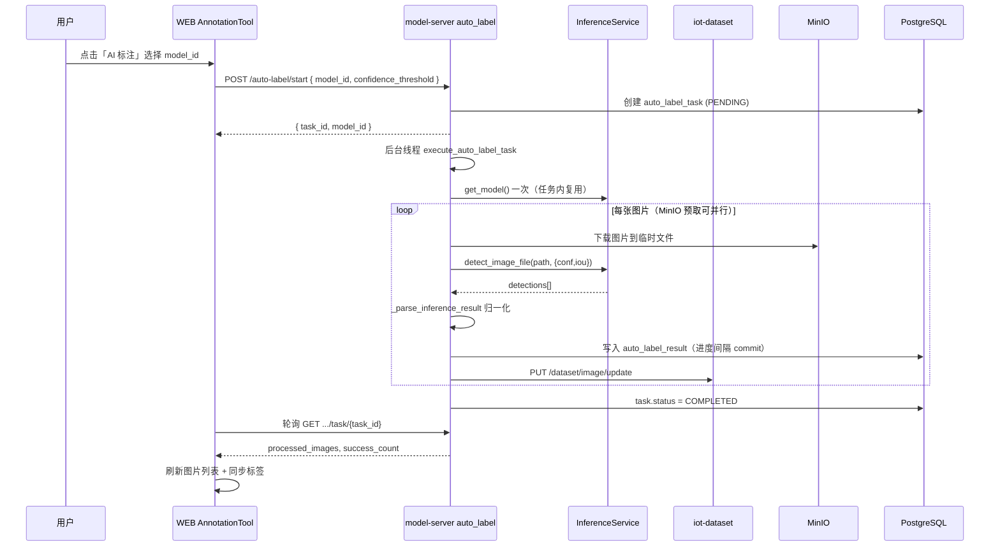

# EasyAIoT 自动化标注 — 详细设计文档

> 版本：1.2.0  
> 更新日期：2026-06-15  
> 所属模块：AI model-server + WEB 数据集标注工具 + iot-dataset  
> 快速说明：见 [AUTO_LABEL_README.md](../AUTO_LABEL_README.md)  
> 关联：[SAM_UNIVERSAL_RECOGNITION_DESIGN.md](./SAM_UNIVERSAL_RECOGNITION_DESIGN.md)（SAM 冷启动标注，同样采用进程内直连推理）

---

## 1. 背景与目标

### 1.1 业务背景

在目标检测类模型训练流程中，图像标注是耗时最长的环节。EasyAIoT 将「**选择模型 → 进程内推理 → 标注写回**」整合进统一数据集标注平台，使用户在标注画布中一键对整库图片执行 AI 批量推理，并将结果以与手工标注相同的 JSON 格式持久化，便于后续划分用途、导出 YOLO、同步 Minio 训练。

**2026-06 架构变更：** 自动标注 **不再依赖**「模型部署 + Nacos 推理服务」；改为在 `model-server` 内通过 **`model_id` 直连 `InferenceService`**，调用链更短，并做了预取并行、轻量推理、进度批量落库等性能优化。

### 1.2 设计目标

| 目标 | 说明 |
|------|------|
| 统一入口 | 废弃独立 `auto-labeling` 微服务，功能收敛至 `AnnotationTool` |
| **直连推理** | 批量/单张标注在 model-server 进程内加载权重推理，**无需 deploy running** |
| 格式一致 | AI 标注与手工标注共用归一化矩形 + `label` 字段 |
| 异步批量 | 大数据集后台线程处理，前端轮询进度 |
| 可运维 | 任务/结果落库，支持失败追溯 |
| 易用引导 | 前端分步提示、选择 **有权重的 model_id** |

### 1.3 非目标（当前版本不做）

- Java `DatasetController.autoLabelDataset()` 空桩接口的实现
- `SettingsModal` 本地 YOLO11 插件管理（未接入）
- 任务暂停/恢复/取消
- COCO / VOC 导出（导出已迁移至 iot-dataset，仅 YOLO）
- 自动标注走 Nacos / deploy 子进程（**已移除**）

---

## 2. 系统架构

### 2.1 逻辑架构

```
┌─────────────────────────────────────────────────────────────────────────┐
│  WEB 标注平台 (AnnotationTool)                                          │
│  ├─ AILabelModal        启动批量 AI 标注（选择 model_id）                │
│  ├─ ImportDatasetModal  导入（iot-dataset /annotation/*）                │
│  └─ ExportDatasetModal  导出（iot-dataset /annotation/export）           │
└───────────────────────────────┬─────────────────────────────────────────┘
                                │ HTTP /admin-api/model/dataset/...
                                ▼
┌─────────────────────────────────────────────────────────────────────────┐
│  网关 iot-gateway  →  lb://model-server (AI Flask)                       │
│  ├─ auto_label_bp      任务编排 + InferenceService 直连推理               │
│  └─ model_bp           模型列表（前端选 model_id）                        │
└───────┬─────────────────────────────┬───────────────────────────────────┘
        │ JAVA_BACKEND_URL            │ 同进程
        ▼                             ▼
┌───────────────────┐         ┌──────────────────────────────┐
│ iot-dataset (Java)│         │ InferenceService              │
│ 图片元数据 / 标注  │         │ detect_image_file() 轻量推理   │
└─────────┬─────────┘         │ YOLO / ONNX 权重缓存           │
          │                   └──────────────────────────────┘
          ▼
┌───────────────────┐         ┌──────────────────────────────┐
│ MinIO             │         │ PostgreSQL (iot-ai)           │
│ 图片对象存储       │         │ auto_label_task / result      │
└───────────────────┘         └──────────────────────────────┘
```

> **说明：** `deploy_service` + Nacos + `run_deploy.py` 仍用于 **对外推理 API、VIDEO 算法任务、集群 `/model/cluster/inference`**，与 **自动标注链路分离**。

### 2.2 服务边界

| 职责 | 负责服务 | 说明 |
|------|----------|------|
| 任务编排、推理调用、坐标转换 | AI `auto_label.py` | 核心自动化逻辑 |
| **推理执行** | **`InferenceService`** | **`detect_image_file()`，同进程加载 PT/ONNX** |
| 图片 CRUD、标注持久化 | iot-dataset | `PUT /dataset/image/update` |
| 导入/导出/抽帧 | iot-dataset | `DatasetAnnotationController` |
| 任务状态存储 | AI PostgreSQL | `auto_label_task` / `auto_label_result` |
| 模型元数据 | AI `Model` 表 | `model_id` + 权重路径 |

### 2.3 网关路由

前端请求：`/dev-api/model/dataset/...`  
代理后：`http://gateway:48080/admin-api/model/dataset/...`  
转发至：`lb://model-server`

蓝图注册（`AI/run.py`）：

```python
app.register_blueprint(auto_label.auto_label_bp, url_prefix='/model/dataset')
app.register_blueprint(model.model_bp, url_prefix='/model')
```

---

## 3. 核心流程

### 3.1 批量 AI 标注时序



### 3.2 单张 AI 标注（API 已实现，前端未接入）

```
POST /model/dataset/dataset/{dataset_id}/auto-label/image/{image_id}
Body: { "model_id": 12, "confidence_threshold": 0.5 }
```

同步执行，适用于「当前画布一键推理」场景；同样直连 `InferenceService`，可在后续版本接入顶栏按钮。

### 3.3 与旧方案对比（调用链）

| 环节 | 旧方案 | 现方案 |
|------|--------|--------|
| 启动参数 | `model_service_id` | **`model_id`** |
| 前置条件 | deploy `status=running` + Nacos | **Model 表有 PT/ONNX 权重** |
| 推理 | HTTP → deploy `/inference` | **`InferenceService.detect_image_file()`** |
| 单张副作用 | 完整 inference_task + MinIO 上传 | **仅返回 detections** |
| 典型失败 | Nacos 不可达、服务未启动 | 权重缺失、GPU OOM |

---

## 4. 数据模型

### 4.1 PostgreSQL（AI 库）

DDL 见 `.scripts/postgresql/iot-ai10.sql`；老库可通过 `ensure_auto_label_task_model_id_column()` 补 `model_id` 列。

#### auto_label_task

| 字段 | 类型 | 说明 |
|------|------|------|
| id | serial PK | 任务 ID |
| dataset_id | bigint | 数据集 ID（对应 Java 库） |
| **model_id** | int FK→`model.id` | **直连推理所用模型（推荐）** |
| model_service_id | int FK→`ai_service.id` | **兼容旧数据**；新请求应传 model_id |
| status | varchar(20) | PENDING / PROCESSING / COMPLETED / FAILED |
| total_images | int | 待处理总数 |
| processed_images | int | 已处理数 |
| success_count | int | 成功数 |
| failed_count | int | 失败数 |
| confidence_threshold | float | 置信度阈值 |
| error_message | text | 任务级错误 |
| started_at / completed_at | timestamp | 时间戳 |

#### auto_label_result

| 字段 | 类型 | 说明 |
|------|------|------|
| task_id | int FK | 所属任务 |
| dataset_image_id | bigint | 图片 ID |
| annotations | text | 标注 JSON |
| status | SUCCESS / FAILED | 单张结果 |
| error_message | text | 单张错误 |

### 4.2 标注 JSON 格式（写回 Java）

与前端 `AnnotationTool` 手工标注一致：

```json
[
  {
    "label": "person",
    "confidence": 0.87,
    "points": [
      { "x": 0.12, "y": 0.34 },
      { "x": 0.56, "y": 0.34 },
      { "x": 0.56, "y": 0.78 },
      { "x": 0.12, "y": 0.78 }
    ],
    "type": "rectangle",
    "auto": true,
    "color": "#52c41a"
  }
]
```

- 坐标：**归一化** 0~1，相对原图宽高  
- `label`：类别**名称**（与 `class_name` 对应，非 shortcut 数字）  
- `auto: true`：标识 AI 生成，便于 UI 区分  

### 4.3 推理结果输入格式

`detect_image_file()` 返回 **detections 列表**（`_parse_inference_result` 同时兼容 `predictions` 字段）：

```json
[
  {
    "class": 0,
    "class_name": "person",
    "confidence": 0.87,
    "bbox": [120, 80, 340, 260]
  }
]
```

`bbox` 为**像素坐标**，由 `_parse_inference_result` 裁剪并归一化。

---

## 5. API 规格

基础路径：`/admin-api/model/dataset`（网关）或 `/model/dataset`（直连 model-server）

### 5.1 启动批量标注

```
POST /dataset/{dataset_id}/auto-label/start
Content-Type: application/json

{
  "model_id": 12,
  "confidence_threshold": 0.5
}
```

| 参数 | 说明 |
|------|------|
| **model_id** | **必填（推荐）**；对应 `Model` 表，需有权重文件 |
| model_service_id | **兼容旧客户端**；解析为关联 model_id，若服务未 running 会提示改用 model_id |
| confidence_threshold | 默认 0.5 |

| 响应 code | 说明 |
|-----------|------|
| 0 | 成功，`data.task_id`、`data.model_id` |
| 400 | 未选模型 / model_id 无效 / 模型无权重 |
| 404 | 模型不存在 |
| 500 | 服务内部错误 |

实现：`AI/app/blueprints/auto_label.py::start_auto_label`

### 5.2 查询任务状态

```
GET /dataset/{dataset_id}/auto-label/task/{task_id}
```

返回 `to_dict()` 全字段，含 `model_id`、`processed_images`、`success_count`、`failed_count`、`status`；若有关联模型则附带 `model: { id, name, version }`。

### 5.3 任务列表

```
GET /dataset/{dataset_id}/auto-label/tasks?page=1&page_size=10
```

### 5.4 单张标注

```
POST /dataset/{dataset_id}/auto-label/image/{image_id}
Body: { "model_id": 12, "confidence_threshold": 0.5 }
```

### 5.5 模型选择（前端）

推荐调用模型列表 API，筛选 **有权重的模型**：

```
GET /admin-api/model/list
```

或训练中心已有模型详情接口；**不再要求** `GET /deploy_service/list?status=running`。

### 5.6 代理类接口（转发 iot-dataset）

| 路径 | 说明 |
|------|------|
| POST `.../auto-label/export` | 转发 `/dataset/{id}/annotation/export` |
| POST `.../extract-frames` | 转发抽帧 |
| POST `.../import-labelme` | 转发 LabelMe 导入 |

> 推荐前端新代码直接使用 `@/api/device/dataset` 中 `/dataset/{id}/annotation/*` 接口。

---

## 6. 后端实现要点

### 6.1 异步任务

- 使用 `threading.Thread(daemon=True)` + Flask `app.app_context()`  
- 进度按 **`AUTO_LABEL_PROGRESS_COMMIT_INTERVAL`**（默认 10）批量 `commit`，支持前端轮询  
- 单张失败记入 `auto_label_result`，不中断整批任务  

### 6.2 直连推理（核心）

```python
inference_service = InferenceService(model_id)
inference_service.get_model()  # 任务开始时加载一次

detections = inference_service.detect_image_file(temp_path, {
    'conf_thres': task.confidence_threshold,
    'iou_thres': 0.45,
})
annotations = _parse_inference_result({'detections': detections}, width, height)
```

`_resolve_model_id()` 逻辑：

1. 优先请求体 **`model_id`**
2. 校验 `Model` 存在且 `_model_has_weights()`（PT/ONNX/TorchScript 等）
3. 若仅传 **`model_service_id`**：查 `AIService` → 取 `model_id`（服务未 running 时返回错误并提示改用 model_id）

### 6.3 性能优化（已实现）

| 优化 | 配置 / 代码 | 作用 |
|------|-------------|------|
| 任务内模型复用 | `get_model()` 任务启动时一次 | 避免每张图重复 load |
| 轻量检测 | `detect_image_file()` | 不创建 inference_task、不上传 MinIO 结果 |
| MinIO 预取并行 | `AUTO_LABEL_PREFETCH_WORKERS`（默认 2） | 下载与推理流水线重叠 |
| 进度批量落库 | `AUTO_LABEL_PROGRESS_COMMIT_INTERVAL`（默认 10） | 降低 PostgreSQL 写入 |
| 权重缓存 | `InferenceService.model_cache` / `onnx_cache` | 同路径跨请求复用 |
| GPU FP16 | PyTorch 模型 `half()` | 降低显存与延迟 |

### 6.4 图片拉取

`_fetch_all_dataset_images` 分页调用：

```
GET {JAVA_BACKEND_URL}/admin-api/dataset/image/page
  ?datasetId=&pageNo=&pageSize=1000
```

单页上限与 Java `PageParam.PAGE_SIZE_MAX` 对齐（1000）。

### 6.5 MinIO 路径解析

路径格式：

```
/api/v1/buckets/{bucket}/objects/download?prefix={object_key}
```

由 `_parse_minio_path` 解析后经 `ModelService.download_from_minio` 下载；`_download_dataset_image` 供预取线程调用。

### 6.6 写回 Java

```
PUT {JAVA_BACKEND_URL}/admin-api/dataset/image/update
{
  "id": image_id,
  "datasetId": dataset_id,
  "annotations": "<JSON string>",
  "completed": 1 | 0
}
```

注意：Java VO 高度字段名为 `heigh`（历史拼写），批量任务以 PIL 读取实际尺寸为准。

---

## 7. 前端设计

### 7.1 页面结构

| 组件 | 路径 | 职责 |
|------|------|------|
| AnnotationTool | `dataset/components/AnnotationTool/index.vue` | 主标注画布 |
| AILabelModal | `AutoLabel/AILabelModal/index.vue` | 批量 AI 配置弹窗 |
| ImportDatasetModal | `AutoLabel/ImportDatasetModal/index.vue` | 多格式导入 |
| ExportDatasetModal | `AutoLabel/ExportDatasetModal/index.vue` | YOLO 导出 |
| AnnotationWorkflowBar | 工作流四步：导入→标注→划分→同步 |
| AnnotationProgressStrip | 进度条 + 情境化引导文案 |

API 封装：`WEB/src/api/device/auto-label.ts`

### 7.2 用户动线（推荐）

```
1. 数据集详情 → 进入标注工具
2. 「添加」→ 导入图片 / 上传 / 抽帧
3. 训练中心 → 训练完成（或上传模型）→ 确认 model 有权重的 model_id
4. 标注工具顶栏 → 「AI 标注」→ 选择模型 → 开启
5. 等待顶栏进度提示完成 → 检查画布标注框
6. 必要时在标签面板确认类别已同步
7. 工作流 → 划分用途 → 同步 Minio → 导出 / 训练
```

> **无需** 为自动标注单独「部署并启动推理服务」。若需对外 API 推理或 VIDEO 算法任务，再在部署页启动 deploy。

### 7.3 易用性设计要点

| 设计点 | 实现 |
|--------|------|
| 前置条件可见 | 弹窗内说明需选择 **有权重文件的模型** |
| 无可用模型空状态 | 提示先训练/上传模型，或前往训练中心 |
| 批量进度反馈 | 顶栏显示 `已处理/总数` + 成功/失败数 |
| 工作流提示 | 待标注时推荐 AI 批量标注入口 |
| 标签同步 | 任务完成后 `syncTagsFromImport` 扫描创建标签 |
| AI 按钮视觉区分 | 橙色样式 `ai-batch-btn` |

### 7.4 轮询策略

- 间隔：2500ms  
- 终止条件：`COMPLETED` / `FAILED` / 请求异常  
- 完成后：刷新图片列表、同步标签、刷新 syncCheck  

### 7.5 已知前端局限

| 项 | 状态 |
|----|------|
| 单张画布 AI 推理按钮 | 未实现（API 已有） |
| 任务历史列表 UI | 未实现（API 已有） |
| 批量任务取消 | 未实现 |
| 前端仍传 model_service_id | 建议迁移为 model_id |
| SettingsModal (YOLO11) | 未接入 |

---

## 8. 部署与配置

### 8.1 环境变量（AI / model-server）

```bash
# Java 网关或 dataset 根地址（用于拉取/更新图片）
JAVA_BACKEND_URL=http://iot-gateway:48080

# PostgreSQL（auto_label 表）
DATABASE_URL=postgresql://...

# MinIO（与 ModelService 一致）
MINIO_ENDPOINT=...

# 自动标注性能（可选）
AUTO_LABEL_PREFETCH_WORKERS=2
AUTO_LABEL_PROGRESS_COMMIT_INTERVAL=10
```

> Nacos 对 **自动标注非必需**；model-server 其他功能或集群推理仍可能使用 Nacos。

### 8.2 前置检查清单

- [ ] 网关 `/admin-api/model/**` 可达 model-server  
- [ ] PostgreSQL 已执行 `iot-ai10.sql` 或 `db.create_all()`（含 `auto_label_task.model_id`）  
- [ ] 目标 **`Model` 记录存在且有权重的路径**（`model_path` / `onnx_model_path` 等）  
- [ ] `JAVA_BACKEND_URL` 从 AI 容器内可访问 dataset 接口  
- [ ] MinIO 桶与图片 `path` 字段可下载  
- [ ] GPU 可用（可选，CPU 亦可但较慢）  

### 8.3 故障排查

| 现象 | 可能原因 | 处理 |
|------|----------|------|
| 启动报请选择 model_id | 未传 model_id | 传有效模型 ID |
| 模型无可用的权重文件 | 未训练完成或未上传 | 训练/导出后确认 Model 路径 |
| 仍传 model_service_id 报错 | 服务未 running | **改用 model_id 直连** |
| 任务 FAILED：未关联有效模型 | task 无 model_id | 重新创建任务 |
| 任务完成但无框 | 置信度过高 / 类别不匹配 | 降低 threshold |
| 有框但显示「未知标签」 | 标签未创建 | syncTags；或手动添加 |
| 更新图片失败 | JAVA_BACKEND_URL 错误 | 修正环境变量 |
| 整体很慢 | CPU 推理 / 未开预取 | 配置 GPU；调大 `PREFETCH_WORKERS` |

---

## 9. 安全与权限

- 前端请求携带 `X-Authorization: Bearer {jwt}`  
- AI → Java 内部调用：iot-dataset `SecurityConfiguration` 对 `PREFIX/**` 为 `permitAll`（内网信任）  
- 生产环境建议：AI 服务使用服务间 Token 或走内部网关  

---

## 10. 性能与扩展

### 10.1 当前性能特征

- 单线程顺序推理 + **可选 MinIO 预取并行**（默认 2 worker）  
- 每图一次 **进程内** 推理 + 一次 Java 写回（图片列表已批量拉取）  
- 无 deploy HTTP 跳数，较旧方案延迟更低  
- 大数据集（>5000 张）耗时长，无断点续跑  

### 10.2 演进建议

1. **任务队列化**：Celery / Redis 队列 + 并发 worker  
2. **批量推理**：多图 batch 送入 GPU  
3. **任务取消**：`POST /task/{id}/cancel` + 线程 Event  
4. **单张画布 AI**：顶栏按钮调用 `labelSingleImage`  
5. **SAM 冷启动**：见 [SAM 设计文档](./SAM_UNIVERSAL_RECOGNITION_DESIGN.md)  
6. **置信度按类别**：per-class threshold  

---

## 11. 测试建议

### 11.1 接口测试

```bash
# 启动任务（直连 model_id）
curl -X POST "http://localhost:48080/admin-api/model/dataset/dataset/3/auto-label/start" \
  -H "Content-Type: application/json" \
  -d '{"model_id":12,"confidence_threshold":0.5}'

# 轮询状态
curl "http://localhost:48080/admin-api/model/dataset/dataset/3/auto-label/task/1"
```

### 11.2 端到端验收

1. 导入 ≥10 张测试图  
2. 确认训练产出的 **model_id** 在 Model 表有权重路径（**无需 deploy**）  
3. 执行 AI 批量标注，观察顶栏进度  
4. 随机抽查 3 张：框位置、类别名、completed 状态  
5. 确认标签面板已有所需类别  
6. 导出 YOLO ZIP 验证 labels 目录  

---

## 12. 文档与代码索引

| 类型 | 路径 |
|------|------|
| 后端蓝图 | `AI/app/blueprints/auto_label.py` |
| **直连推理** | `AI/app/services/inference_service.py` → `detect_image_file` |
| 数据模型 | `AI/db_models.py` → `AutoLabelTask`, `ensure_auto_label_task_model_id_column` |
| 集群推理（非自动标注） | `AI/app/services/cluster_inference_service.py` |
| deploy 推理（非自动标注） | `AI/services/ai_service/run_deploy.py` |
| 前端 API | `WEB/src/api/device/auto-label.ts` |
| 标注主界面 | `WEB/src/views/dataset/components/AnnotationTool/index.vue` |
| AI 弹窗 | `WEB/src/views/dataset/components/AutoLabel/AILabelModal/index.vue` |
| SAM 冷启动（规划） | `AI/docs/SAM_UNIVERSAL_RECOGNITION_DESIGN.md` |
| SQL | `.scripts/postgresql/iot-ai10.sql` |

---

## 附录 A：与旧方案对比

| 项目 | 旧独立 auto-labeling (8000) | v1.1 deploy+Nacos | **v1.2 直连（当前）** |
|------|----------------------------|-------------------|----------------------|
| 入口 | 独立 Tab | AnnotationTool | AnnotationTool |
| 推理 | 独立服务 | deploy HTTP | **InferenceService 同进程** |
| 启动参数 | — | model_service_id | **model_id** |
| 前置 | — | deploy running | **模型有权重即可** |
| 导出 | auto_label export | iot-dataset | iot-dataset |

## 附录 B：状态机

```
PENDING → PROCESSING → COMPLETED
                    ↘ FAILED
```

单张结果：`SUCCESS` / `FAILED`（不影响任务继续）
