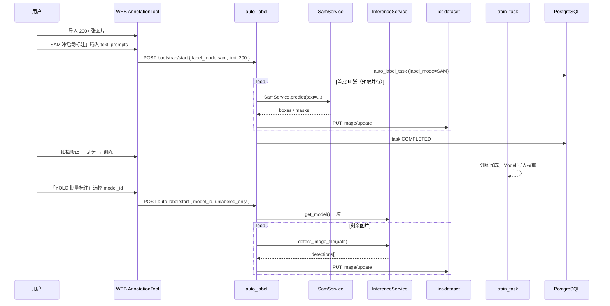
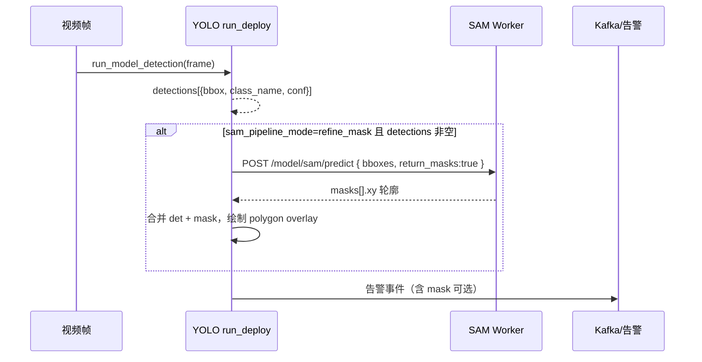
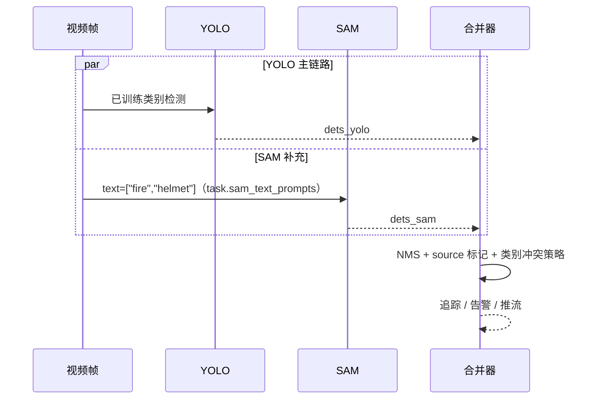
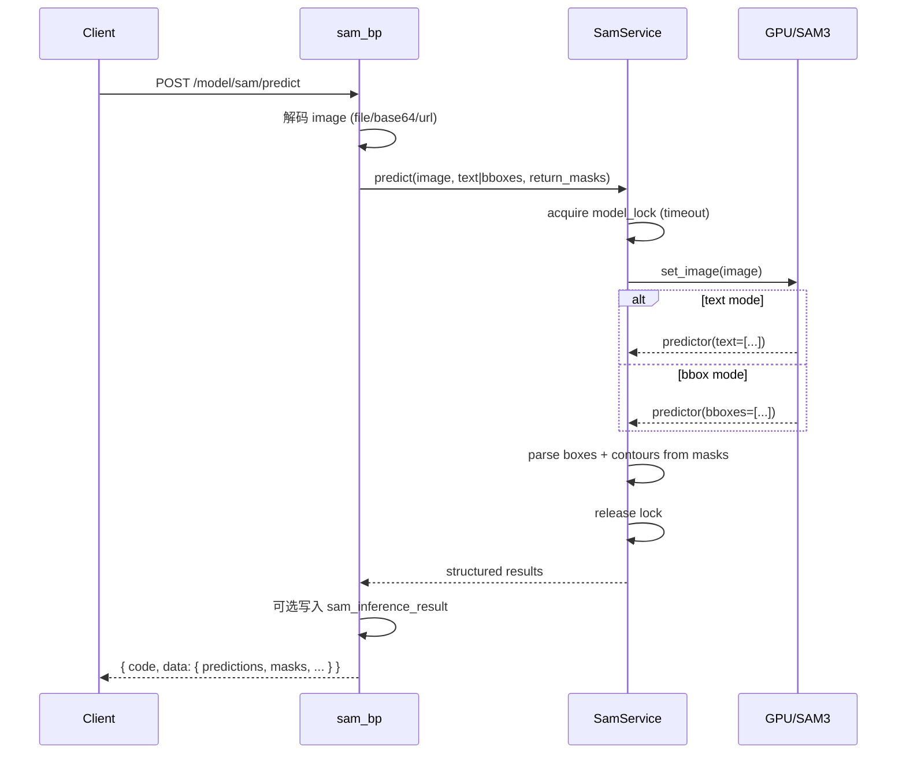

# EasyAIoT 万物识别（SAM）— 详细设计文档

> 版本：1.2.0  
> 更新日期：2026-06-15  
> 所属模块：AI model-server + WEB 数据集标注 + VIDEO 算法任务  
> 关联文档：[AUTO_LABEL_DESIGN.md](./AUTO_LABEL_DESIGN.md)（自动标注已改为 **model_id 直连 InferenceService**，不再依赖 deploy + Nacos）
> 参考实现：[`/projects/sam-changkang`](file:///projects/sam-changkang)（SAM3 文本/框选推理服务）、[`/projects/segment-anything`](file:///projects/segment-anything)（Meta SAM1 交互式分割与 ONNX 导出）

---

## 1. 背景与目标

### 1.1 业务背景

EasyAIoT 当前目标检测链路依赖 **YOLO 等闭集模型**：需先收集数据、标注、训练，再部署推理。类别固定，新增目标必须重新训练。

**Segment Anything Model（SAM）** 系列提供 **零样本 / 开放词汇** 的分割与定位能力，用户可通过 **文本描述、框选、点选、涂抹** 等方式指定「任意目标」，无需重新训练即可在标注、推理、告警二次确认等场景使用。

| 场景 | 现状痛点 | SAM 价值 |
|------|----------|----------|
| **零样本冷启动标注** | 新场景无训练数据，无法启动 YOLO 自动标注 | SAM 先 0 样本标注约 200 张 → 训练 YOLO → 再用 YOLO 规模化自动标注 |
| 数据集标注 | 需先训练 YOLO 才能 AI 批量标注 | 输入英文类别词即可批量框选/分割 |
| **算法任务补充识别** | 已部署 YOLO 仅覆盖训练类别，漏检开放词汇目标 | Pipeline：YOLO 检测 + SAM 分割/补充；或 SAM 文本 prompt 并行补检 |
| 临时巡检 | 无对应训练模型 | 「黄色校车」「戴红帽的人」等文本 prompt |
| 告警复核 | 固定类别易误报 | 用文本或框选二次确认目标是否存在 |
| 交互式分割 | 仅支持矩形框 | 返回多边形 mask，支持实例分割导出 |

### 1.2 设计目标

| 目标 | 说明 |
|------|------|
| 统一入口 | 在 AI `model-server` 增加 `/model/sam` 蓝图，与 OCR、plate 等能力并列 |
| 双引擎支持 | **SAM3 语义分割**（文本/框选，主路径）+ **Meta SAM1**（点/框/全自动，交互与 AMG） |
| 格式复用 | 检测框结果兼容现有 `predictions[]`；分割结果兼容标注工具多边形格式 |
| 可部署 | 支持 GPU 常驻进程、Docker 独立容器、可选 ONNX 浏览器端解码 |
| 可运维 | 推理结果落库 `sam_inference_result`，支持耗时与 prompt 追溯 |
| 冷启动闭环 | SAM 零样本标注 → 人工抽检 → YOLO 训练 → **model_id 直连**自动标注剩余数据 |
| 调用链一致 | SAM 与 YOLO 自动标注均在 model-server 进程内完成，**不依赖 deploy/Nacos** |
| 算法任务增强 | VIDEO 实时/抓拍/巡检任务支持 YOLO+SAM Pipeline 与开放词汇补充 |
| 渐进集成 | 先 API + 推理页，再对接 auto_label、算法任务、VIDEO 告警 |

### 1.3 非目标（当前版本不做）

- SAM2 视频流式跟踪（留作 Phase 3）
- 浏览器端完整 SAM3 推理（仅评估 SAM1 mask-decoder ONNX 轻量方案）
- 多租户 GPU 弹性调度 / K8s HPA
- 中文 prompt 原生支持（Phase 1 要求英文或英文同义描述，与参考实现一致）

---

## 2. 模型选型

### 2.1 SAM 系列对比

| 维度 | Meta SAM1 | Meta SAM2 | SAM3（Ultralytics） |
|------|-----------|-----------|---------------------|
| 来源 | `segment-anything` | `segment-anything-2` | Ultralytics `SAM3SemanticPredictor` |
| 开放词汇文本 | ❌ | ❌ | ✅ `text=["car","person with blue cloth"]` |
| 点/框 prompt | ✅ | ✅ | ✅ `bboxes=[[x1,y1,x2,y2]]` |
| 全自动分割 AMG | ✅ | ✅ | 部分（依赖 API） |
| 视频 | ❌ | ✅ 流式 memory | ✅ 参考 `video_service.py` 逐帧 |
| ONNX 导出 | ✅ mask decoder | 有限 | 待评估 |
| 典型延迟 (GPU) | 100–500 ms/图 | 类似 | **5–30 ms/图**（参考 sam-changkang） |
| 显存 | vit_h ~8G+ | 更高 | 建议 ≥8G，推荐 ≥16G |
| EasyAIoT 定位 | 交互标注、AMG | 后续视频 | **万物识别主引擎** |

**结论：**

- **Phase 1 主引擎**：SAM3（对齐 [`sam-changkang/model_service.py`](file:///projects/sam-changkang/model_service.py)）
- **Phase 2 补充**：Meta SAM1 `vit_b/l/h`（对齐 [`segment-anything`](file:///projects/segment-anything) 点选/AMG/ONNX）
- **Phase 3 扩展**：SAM2 视频、与 VIDEO 巡检联动

### 2.2 与 YOLO 的边界

```
┌─────────────────────────────────────────────────────────────┐
│  YOLO / 自定义训练模型                                       │
│  · 固定类别、高精度、低延迟、适合生产告警主链路               │
└─────────────────────────────────────────────────────────────┘
                              ↕ 互补
┌─────────────────────────────────────────────────────────────┐
│  SAM 万物识别                                                │
│  · 零样本、开放词汇、分割 mask、适合标注/复核/临时检测         │
└─────────────────────────────────────────────────────────────┘
```

二者通过 **auto_label** 统一编排：**YOLO 量产**与 **SAM 冷启动**均在 `model-server` 进程内直连推理，**无需**先部署 Nacos 推理服务；生产 **VIDEO 算法任务**仍使用独立 `run_deploy.py` 子进程。

### 2.3 SAM 与 YOLO 协同模式

EasyAIoT 落地采用 **「先 SAM 冷启动、后 YOLO 量产」** 与 **「算法任务 Pipeline 补充」** 两条主线，并保留 SAM 独立推理能力。

| 模式 | 核心逻辑 | 精度 | 速度 | 算力/部署 | 典型场景 |
|------|----------|------|------|-----------|----------|
| **模式一：Pipeline 串联** | YOLO 检测 + SAM 分割/精修 | 极高（边界精细） | 中等（双模型） | 要求较高 | 算法任务告警框精修、实例分割 overlay |
| **模式二：SAM 冷启动标注** | SAM 0 样本批量标注 → 训练 YOLO | 中（依赖 prompt） | 标注阶段慢、量产后快 | 标注 GPU 节点 + 训练节点 | 新场景首批 ~200 张 bootstrap |
| **模式三：并行补充识别** | YOLO 主检 + SAM 文本补检 | 开放词汇高 | 中等 | 同 Pipeline | YOLO 未覆盖类别（如 fire、helmet） |
| 模式四：SAM 独立 | 仅 SAM3 文本/框选 | 中–高 | SAM3 较快 | 单 SAM Worker | 临时分析、画布交互标注 |
| 模式五：YOLO 独立 | 仅已训练 YOLO | 闭集高 | 最快 | 低 | 量产自动标注、生产告警主链路 |

**代表性参考：** Pipeline 串联类工作 I-SAM-YOLOv5；本方案在 EasyAIoT 中映射为 `algorithm_task.sam_pipeline_mode=refine_mask`。

---

## 3. 系统架构

### 3.1 逻辑架构

```
┌──────────────────────────────────────────────────────────────────────────┐
│  WEB                                                                      │
│  ├─ AnnotationTool（扩展）    SAM 冷启动向导 · 开放词汇批量标注              │
│  ├─ 训练中心（现有）          SAM 标注完成 → 一键创建训练任务                │
│  ├─ 算法任务配置（扩展）      YOLO+SAM Pipeline / 开放词汇补充               │
│  └─ SAM 推理页（新）          文本/框选 · 结果叠加预览                       │
└───────────────────────────────┬──────────────────────────────────────────┘
                                │ HTTP /admin-api/model/sam/...  /video/algorithm/...
                                ▼
┌──────────────────────────────────────────────────────────────────────────┐
│  网关 iot-gateway                                                         │
│  ├─ model-server /model/sam          SAM 推理 · 冷启动编排                  │
│  ├─ model-server /model/dataset      auto_label（YOLO/SAM 均进程内直连）   │
│  └─ video-server                     算法任务配置下发 · 心跳                  │
└───────┬─────────────────────────────┬────────────────────────────────────┘
        │                             │
        ▼                             ▼
┌───────────────────┐         ┌──────────────────────────────────────────┐
│ AI model-server   │         │ VIDEO 算法运行时                            │
│ SamService        │         │ realtime / snap / patrol run_deploy.py      │
│ InferenceService  │         │ run_model_detection()                       │
│ auto_label        │         │   └─ + sam_supplement_hook（新增）           │
│ train_task        │         │                                             │
└───────────────────┘         └──────────────────────────────────────────┘
```

### 3.2 与现有代码的衔接

| 项 | 现状 | 本方案 |
|----|------|--------|
| 蓝图注册 | `AI/run.py` 已注册 `sam.sam_bp`，**蓝图文件尚未实现** | 新增 `app/blueprints/sam.py` |
| 数据表 | `db_models.SAMInferenceResult` 已定义 | `db.create_all()` 自动建表 |
| **YOLO 自动标注** | **`auto_label.py` 已改为 `model_id` + `InferenceService.detect_image_file`** | SAM 扩展同路径，**不对接 Nacos/deploy** |
| `AutoLabelTask` | 已增加 `model_id` 列 | SAM 模式 `label_mode=sam`，YOLO 模式填 `model_id` |
| 算法任务 | `AlgorithmTask` 仅 `model_ids` + `run_deploy` 子进程 | 扩展 `sam_supplement_*`；与标注链路分离 |

蓝图注册（已存在于 `AI/run.py`）：

```python
app.register_blueprint(sam.sam_bp, url_prefix='/model/sam')
app.register_blueprint(auto_label.auto_label_bp, url_prefix='/model/dataset')
```

### 3.2.1 自动标注直连推理（已实现 · SAM 应对齐）

**变更摘要（2026-06）：** 批量/单张 AI 标注 **不再** 经 `ClusterInferenceService` → Nacos → `run_deploy.py /inference`，改为在 **同一 model-server 进程** 内加载权重并推理。

```
WEB POST /auto-label/start { model_id }
        ↓
auto_label.execute_auto_label_task
        ↓
InferenceService(model_id).get_model()     ← 任务内只加载一次
        ↓
detect_image_file(path, {conf,iou})      ← 轻量推理，无 MinIO 结果上传
        ↓
_parse_inference_result → PUT iot-dataset
```

| 对比项 | 旧方案（deploy + Nacos） | 现方案（直连） |
|--------|--------------------------|----------------|
| 前置条件 | 部署推理服务 + Nacos 注册 | 模型表 `model_id` 有 PT/ONNX 权重即可 |
| 请求参数 | `model_service_id` | **`model_id`**（`model_service_id` 仅兼容旧客户端） |
| 调用链 | auto_label → HTTP → deploy 子进程 | auto_label → **InferenceService**（同进程） |
| 单张推理 | 完整 inference_task + MinIO | **`detect_image_file`** 仅返回 detections |
| 失败点 | Nacos 不可达、服务未 running | 权重缺失、GPU OOM |

**已落地性能优化（`auto_label.py` / `inference_service.py`）：**

| 优化 | 环境变量 / 实现 | 作用 |
|------|-----------------|------|
| 任务内模型复用 | `get_model()` 任务开始时调用一次 | 避免每张图重复 load YOLO/ONNX |
| 轻量检测 API | `detect_image_file()` | 跳过推理任务落库、结果图/JSON 上传 MinIO |
| MinIO 预取并行 | `AUTO_LABEL_PREFETCH_WORKERS`（默认 2） | 下载与推理流水线重叠 |
| 进度批量落库 | `AUTO_LABEL_PROGRESS_COMMIT_INTERVAL`（默认 10） | 降低 PostgreSQL commit 频率 |
| 模型实例缓存 | `InferenceService.model_cache` / `onnx_cache` | 同路径权重跨请求复用 |
| FP16（GPU） | `model.model.half()` | PyTorch 模型半精度推理 |

**SAM 集成原则：** SAM 冷启动/开放词汇标注采用与 YOLO **对称** 的进程内路径（`SamService` 单例 + 任务内 `set_image` 复用），同样 **不** 为标注单独部署 SAM deploy 实例；可选 `SAM_WORKER_URL` 仅在高负载 GPU 隔离时使用。

### 3.3 服务边界

| 职责 | 负责组件 | 说明 |
|------|----------|------|
| HTTP API、鉴权、参数校验 | `sam.py` | Flask 蓝图 |
| SAM 模型加载、推理、锁、预热 | `sam_service.py` | 参考 sam-changkang `ModelService` |
| YOLO/ONNX 直连推理 | `inference_service.py` | `detect_image_file`，供 auto_label 批量调用 |
| 结果解析、坐标归一化 | `sam_result_parser.py` / `_parse_inference_result` | boxes → 标注 JSON |
| 批量标注编排 | `auto_label.py` | SAM → `SamService`；YOLO → `InferenceService` |
| 推理历史 | `SAMInferenceResult` | SAM 可选持久化 |
| VIDEO 生产推理 | `run_deploy.py` 子进程 | 算法任务专用，与标注链路分离 |

### 3.4 场景 A：SAM 零样本冷启动 → YOLO 训练 → 规模化自动标注

**目标：** 用户在新场景下 **无需预先准备标注数据**，先用 SAM 对首批图片（推荐 **200 张**，可配置 100–500）做 0 样本自动标注，经人工抽检后训练 YOLO，再对数据集剩余图片使用 **已训练 YOLO 模型** 高速自动标注。

#### 3.4.1 业务动线（七步闭环）

```
① 导入图片（≥200 建议）
      ↓
② SAM 开放词汇批量标注（text_prompts，label_mode=sam）
      ↓
③ 人工抽检 / 修正（AnnotationTool，目标 ≥90% 可用率）
      ↓
④ 划分用途（train / val / test）
      ↓
⑤ 创建 YOLO 训练任务 → 训练 → 权重写回 Model 记录（PT/ONNX）
      ↓
⑥ 确认 model_id 可用（有权重的模型记录，**无需部署推理服务**）
      ↓
⑦ YOLO 自动标注剩余图片（label_mode=yolo，**model_id**）
```

#### 3.4.2 时序图



#### 3.4.3 关键策略

| 策略 | 说明 |
|------|------|
| 首批数量 | 默认 `bootstrap_limit=200`；类别少且场景单一可 100；复杂场景建议 300–500 |
| 标注形态 | 检测任务用 `annotation_type=rectangle`（SAM bbox）；分割任务用 `polygon` |
| 图片选择 | `bootstrap_selection=unlabeled_first` 优先未标注；或 `random` / `manual_ids` |
| 人工门禁 | `bootstrap_review_required=true` 时，未标记「抽检通过」不允许一键开训 |
| 类别对齐 | `text_prompts` 与后续 YOLO `class_names` 一致（英文）；训练前 `syncTagsFromImport` |
| 切换条件 | 训练 mAP 达标 + **Model 有权重的 model_id** 后，UI 提示 YOLO 自动标注 |

#### 3.4.4 SAM 与 YOLO 自动标注路径对比

| 字段 | SAM 冷启动 | YOLO 量产（现网） |
|------|------------|-------------------|
| `label_mode` | `sam`（规划） | `yolo`（默认，可省略） |
| **`model_id`** | 不需要 | **必填**（训练产出的模型 ID） |
| `model_service_id` | — | **已废弃**，仅兼容旧请求 |
| `text_prompts` | 必填 | 不需要 |
| `confidence_threshold` | SAM conf（默认 0.45） | YOLO conf（默认 0.5） |
| 推理入口 | `SamService.predict()` 进程内 | `InferenceService.detect_image_file()` 进程内 |
| 调用链长度 | auto_label → SamService | auto_label → InferenceService（**无 HTTP  hop**） |
| 共享优化 | 预取并行、进度间隔 commit | 同左 + 任务内 `get_model()` 一次 |
| 典型耗时 | ~200 张 × 30ms ≈ 数分钟 | 同规模 GPU 下显著快于旧 deploy 链路 |

---

### 3.5 场景 B：算法任务补充识别（Pipeline 串联 & 开放词汇补充）

**目标：** 在 VIDEO **实时 / 抓拍 / 巡检** 算法任务中，在已有 YOLO 模型基础上叠加 SAM，实现 **更精细的分割边界** 或 **YOLO 未训练类别的开放词汇补检**，结果合并进入现有告警 / Kafka / 叠加流链路。

#### 3.5.1 子模式

| 子模式 | `sam_pipeline_mode` | 逻辑 | 输出 |
|--------|---------------------|------|------|
| **Pipeline 精修** | `refine_mask` | YOLO 检出 bbox → SAM `bboxes` 模式分割 | 原 bbox + `mask` 多边形，告警图精细 overlay |
| **开放词汇补充** | `open_vocab` | YOLO 主检 + SAM `text` 并行 | 合并检测列表，带来源标签 `source=yolo\|sam` |
| **告警二次确认** | `alert_verify` | YOLO 触发告警帧 → SAM 文本确认 | 有 SAM 框才上报 / 或降低告警等级 |
| 关闭 | `none` | 仅 YOLO | 与现网一致 |

#### 3.5.2 Pipeline 精修时序（模式一）



#### 3.5.3 开放词汇补充时序（模式三）



#### 3.5.4 合并与冲突策略

```python
def merge_yolo_sam_detections(yolo_dets, sam_dets, iou_thresh=0.5):
    """
    1. SAM 结果中与 YOLO 高 IoU 重叠的框：保留 YOLO class，可选采用 SAM mask 精修
    2. SAM 独有框（IoU < thresh）：以 sam_text 类名追加，source='sam'
    3. 告警去重：同一 track_id + 类别在 suppress_time 内不重复
    """
```

#### 3.5.5 接入点（VIDEO 代码）

| 组件 | 文件 | 改动 |
|------|------|------|
| 实时任务 | `VIDEO/services/realtime_algorithm_service/run_deploy.py` | `_run_yolo_on_frame` 后调用 `_sam_supplement()` |
| 抓拍任务 | `VIDEO/services/snapshot_algorithm_service/run_deploy.py` | 同上 |
| 巡检任务 | `VIDEO/services/patrol_algorithm_service/run_deploy.py` | `_run_detection` 后补充 |
| 统一检测 | `VIDEO/app/utils/algo_model_detect.py` | 可选 `run_detection_with_sam_supplement()` |
| 任务配置 | `VIDEO/models.py` → `AlgorithmTask` | 新增 SAM 补充 JSON 字段 |
| 配置下发 | `algorithm_task_launcher_service.py` | 环境变量 `SAM_TEXT_PROMPTS`、`SAM_PIPELINE_MODE` |

#### 3.5.6 性能与触发策略

| 策略 | 说明 |
|------|------|
| `sam_trigger=always` | 每帧或每 N 帧调用 SAM（算力高，慎用） |
| `sam_trigger=on_interval` | 每 `sam_interval_frames` 帧补充一次（推荐 open_vocab） |
| `sam_trigger=on_alert` | 仅 YOLO 告警候选帧做 SAM 确认（推荐 alert_verify） |
| `sam_trigger=on_yolo_empty` | YOLO 无检出时用 SAM 文本兜底 |
| 降采样 | 补充链路可 `sam_imgsz=640`、仅 ROI 裁剪后送 SAM |

**注意：** Pipeline 双模型显存与延迟高于单 YOLO，建议在 **GPU 算法节点** 启用，CPU 节点保持 `sam_pipeline_mode=none`。

---

## 4. 核心能力

### 4.1 推理模式矩阵

| 模式 | prompt_type | 引擎 | 输入 | 输出 |
|------|-------------|------|------|------|
| 文本万物识别 | `text` | SAM3 | `text: ["car","fire"]` | boxes + masks |
| 框选分割 | `box` | SAM3 / SAM1 | `bboxes: [[x1,y1,x2,y2],...]` | masks（+ boxes） |
| 点选分割 | `point` | SAM1 | `points: [[x,y],...], labels: [1,0,...]` | masks |
| 全自动分割 | `auto` | SAM1 AMG | 无 prompt | 全图 masks 列表 |
| 视频逐帧 | `text` | SAM3 | 视频 URL + text[] | 逐帧 boxes（异步任务） |

**约束（与参考实现一致）：**

- `text` 与 `bboxes` **二选一**（`schemas.py` 校验逻辑）
- 文本 prompt 建议 **英文**；检测不到时可换同义词（如 `automobile` ↔ `car`）
- 低配 GPU / CPU：单次 `text` 类别数建议 ≤4
- `return_masks=false` 时仅返回检测框，降低响应体积

### 4.2 SAM3 推理流程（主路径）



### 4.3 Meta SAM1 交互流程（Phase 2）

基于 [`segment-anything/segment_anything/predictor.py`](file:///projects/segment-anything/segment_anything/predictor.py)：

1. `SamPredictor.set_image(image_rgb)` — 计算 image embedding（耗时主要阶段）
2. `predictor.predict(point_coords, point_labels, box, multimask_output)` — 快速多次 prompt
3. AMG：`SamAutomaticMaskGenerator.generate(image)` — 全图候选 mask

**Embedding 缓存策略：** 同一图片多次点选时，`set_image` 仅调用一次；session 级缓存 `(image_hash → embedding)`，TTL 5 分钟。

### 4.4 结果数据结构

#### 4.4.1 对外统一响应（兼容集群推理）

```json
{
  "code": 0,
  "msg": "success",
  "data": {
    "predictions": [
      {
        "class": 0,
        "class_name": "car",
        "confidence": 0.91,
        "bbox": [120, 80, 340, 260]
      }
    ],
    "masks": [
      {
        "class_name": "car",
        "confidence": 0.91,
        "xy": [[[120,80],[125,82],...]],
        "xyn": [[0.12,0.08,...]],
        "contour_count": 1
      }
    ],
    "orig_shape": [1080, 1920],
    "inference_ms": 18,
    "prompt_type": "text",
    "engine": "sam3"
  }
}
```

- `bbox`：**像素坐标** `[x1,y1,x2,y2]`，由 `auto_label._parse_inference_result` / SAM parser 归一化写回
- `xy`：像素多边形轮廓列表（参考 sam-changkang `_parse_results` 中 `cv2.findContours`）
- `xyn`：归一化轮廓（0~1）

#### 4.4.2 写回标注工具（多边形）

```json
[
  {
    "label": "car",
    "confidence": 0.91,
    "points": [
      { "x": 0.12, "y": 0.08 },
      { "x": 0.15, "y": 0.09 }
    ],
    "type": "polygon",
    "auto": true,
    "color": "#722ed1"
  }
]
```

矩形框标注仍用 `type: "rectangle"`（从 bbox 四角转换，与 [AUTO_LABEL_DESIGN.md](./AUTO_LABEL_DESIGN.md) 一致）。

---

## 5. API 规格

基础路径：`/admin-api/model/sam`（经网关）或 `/model/sam`（直连 model-server）

### 5.1 健康检查

```
GET /model/sam/health
```

响应：`{ "status": "healthy", "engine": "sam3", "model_loaded": true, "device": "cuda:0" }`

### 5.2 万物识别推理（核心）

```
POST /model/sam/predict
Content-Type: application/json 或 multipart/form-data
```

**JSON Body（对齐 sam-changkang）：**

```json
{
  "image_base64": "data:image/jpeg;base64,...",
  "text": ["car", "person with blue cloth"],
  "return_masks": true,
  "conf": 0.45,
  "save_result": false
}
```

**或框选模式：**

```json
{
  "image_base64": "...",
  "bboxes": [[100, 100, 300, 400]],
  "return_masks": true
}
```

**multipart 替代：** `file` 字段上传图片，其余参数走 form field。

| 参数 | 类型 | 默认 | 说明 |
|------|------|------|------|
| text | string[] | — | 文本 prompt，与 bboxes 互斥 |
| bboxes | float[][] | — | `[x1,y1,x2,y2]` 像素坐标 |
| return_masks | bool | true | false 仅返回 boxes |
| conf | float | 0.45 | SAM3 置信度，误检多时调高 |
| imgsz | int | 1078 | 与 Config.IMGSZ 一致 |
| save_result | bool | false | true 时结果图上传 MinIO |

| 响应 code | 说明 |
|-----------|------|
| 0 | 成功 |
| 400 | text/bboxes 缺失或同时存在 |
| 413 | 图片超过 MAX_IMAGE_BYTES（默认 10MB） |
| 504 | 推理超时（默认 30s，可配置） |
| 500 | 模型未加载或 GPU 错误 |

### 5.3 点选分割（Phase 2 · SAM1）

```
POST /model/sam/predict/point
```

```json
{
  "image_base64": "...",
  "points": [[500, 300], [520, 310]],
  "point_labels": [1, 0],
  "model_type": "vit_b"
}
```

### 5.4 全自动分割（Phase 2 · AMG）

```
POST /model/sam/predict/auto
```

```json
{
  "image_base64": "...",
  "model_type": "vit_b",
  "points_per_side": 32,
  "pred_iou_thresh": 0.88
}
```

### 5.5 视频万物识别（Phase 2 · 异步）

```
POST /model/sam/video/submit
```

```json
{
  "video_url": "/api/v1/buckets/.../objects/download?prefix=...",
  "text": ["car", "bus"],
  "sample_fps": 2,
  "conf": 0.45
}
```

```
GET /model/sam/video/task/{task_id}
```

参考 [`sam-changkang/video_service.py`](file:///projects/sam-changkang/video_service.py)：`ffmpeg` 解码 → 逐帧 `set_image` + `predictor(text=...)` → 可选合成输出 MP4 上传 MinIO。

### 5.6 推理历史

```
GET /model/sam/history?page=1&page_size=20&prompt_type=text
```

### 5.7 SAM 开放词汇批量标注（扩展 auto_label）

```
POST /model/dataset/{dataset_id}/auto-label/start
```

新增 Body 字段：

```json
{
  "label_mode": "sam",
  "text_prompts": ["person", "helmet", "fire"],
  "confidence_threshold": 0.45,
  "annotation_type": "polygon",
  "return_masks": true
}
```

当 `label_mode=sam` 时 **不需要** `model_id`；走 `SamService` 进程内推理，调用链与 YOLO 直连模式对称。

**YOLO 模式（现网已实现）** 请求示例：

```json
{
  "model_id": 12,
  "confidence_threshold": 0.5
}
```

`_resolve_model_id()` 优先 `model_id`；若仍传 `model_service_id` 则解析为关联 `model_id`（并提示改用直连）。

### 5.8 SAM 冷启动批量标注（场景 A 专用）

```
POST /model/dataset/{dataset_id}/auto-label/bootstrap/start
```

```json
{
  "text_prompts": ["helmet", "vest", "person"],
  "bootstrap_limit": 200,
  "bootstrap_selection": "unlabeled_first",
  "confidence_threshold": 0.45,
  "annotation_type": "rectangle",
  "return_masks": false
}
```

| 字段 | 说明 |
|------|------|
| bootstrap_limit | 本批 SAM 标注张数上限，默认 200 |
| bootstrap_selection | `unlabeled_first` / `random` / `all` |
| annotation_type | `rectangle`（检测冷启动）或 `polygon`（分割冷启动） |

响应与现有 `auto-label/start` 一致，返回 `task_id`；任务记录 `label_mode=sam`、`phase=BOOTSTRAP`。

```
GET /model/dataset/{dataset_id}/auto-label/bootstrap/status
```

返回：首批进度、已标注数、是否达到 `bootstrap_limit`、是否建议进入训练（`ready_for_train`）。

```
POST /model/dataset/{dataset_id}/auto-label/bootstrap/complete-review
```

Body：`{ "review_passed": true, "reviewer_note": "抽检 20 张，2 张已修正" }` — 解除训练门禁。

### 5.9 冷启动完成后 YOLO 量产标注

复用现有接口，显式指定 YOLO 模式：

```
POST /model/dataset/{dataset_id}/auto-label/start
```

```json
{
  "model_id": 12,
  "confidence_threshold": 0.5,
  "sample_selection": "unlabeled_only"
}
```

仅需 **`model_id`**（训练完成且模型表有权重路径），**无需**启动 deploy 推理服务。

### 5.10 算法任务 SAM 补充配置（场景 B · VIDEO API）

```
PUT /admin-api/video/algorithm/task/{task_id}
```

在现有 `AlgorithmTask` 上扩展 JSON 字段（或独立 `sam_supplement_config` 文本列）：

```json
{
  "sam_supplement_enabled": true,
  "sam_pipeline_mode": "refine_mask",
  "sam_text_prompts": ["fire", "smoke"],
  "sam_conf": 0.45,
  "sam_trigger": "on_interval",
  "sam_interval_frames": 25,
  "sam_return_masks": true,
  "sam_merge_iou": 0.5
}
```

| 字段 | 取值 | 说明 |
|------|------|------|
| sam_pipeline_mode | `none` / `refine_mask` / `open_vocab` / `alert_verify` | 见 §3.5.1 |
| sam_trigger | `always` / `on_interval` / `on_alert` / `on_yolo_empty` | 调用频率 |
| sam_text_prompts | string[] | `open_vocab` / `alert_verify` 必填 |

算法子进程通过环境变量读取（`algorithm_task_launcher_service._build_task_deploy_env` 扩展）：

```bash
SAM_SUPPLEMENT_ENABLED=true
SAM_PIPELINE_MODE=refine_mask
SAM_TEXT_PROMPTS=fire,smoke
SAM_TRIGGER=on_interval
SAM_INTERVAL_FRAMES=25
AI_SERVICE_URL=http://model-server:5000
```

运行时调用：

```
POST {AI_SERVICE_URL}/model/sam/predict
```

---

## 6. 数据模型

### 6.1 PostgreSQL（已定义）

`AI/db_models.py` → `SAMInferenceResult`：

| 字段 | 类型 | 说明 |
|------|------|------|
| id | serial PK | 主键 |
| prompt_type | varchar(20) | point / box / auto / text |
| prompt_data | text | JSON：`{"text":["car"]}` 或 `{"bboxes":[...]}` |
| image_url | varchar(500) | 输入图 MinIO URL 或来源标识 |
| result_data | text | 完整响应 JSON（predictions + masks） |
| model_type | varchar(20) | sam3 / vit_b / vit_l / vit_h |
| inference_ms | int | 推理耗时 |
| created_at | timestamp | 创建时间 |

### 6.2 auto_label_task 扩展

**已实现（YOLO 直连）：**

| 字段 | 类型 | 说明 |
|------|------|------|
| **model_id** | int FK → `model.id` | **YOLO 自动标注必填**；直连 InferenceService |
| model_service_id | int FK → `ai_service.id` | **兼容旧数据**；新请求应传 model_id |
| confidence_threshold | float | conf 阈值 |

**SAM 场景待增（迁移脚本或 `ensure_*`）：**

| 字段 | 类型 | 说明 |
|------|------|------|
| label_mode | varchar(20) | `sam` / `yolo`，默认 `yolo` |
| text_prompts | text | JSON 数组，SAM 模式必填 |
| annotation_type | varchar(20) | `rectangle` / `polygon` |
| phase | varchar(20) | `BOOTSTRAP` / `PRODUCTION` |
| bootstrap_limit | int | 冷启动张数上限 |
| review_passed | bool | 人工抽检是否通过 |

### 6.3 algorithm_task SAM 配置（场景 B）

`VIDEO/models.py` → `AlgorithmTask` 新增：

| 字段 | 类型 | 说明 |
|------|------|------|
| sam_supplement_enabled | bool | 是否启用 SAM 补充 |
| sam_supplement_config | text | JSON，结构见 §5.10 |

配置 JSON 示例：

```json
{
  "pipeline_mode": "refine_mask",
  "text_prompts": ["fire"],
  "conf": 0.45,
  "trigger": "on_interval",
  "interval_frames": 25,
  "merge_iou": 0.5,
  "return_masks": true
}
```

### 6.4 建议扩展（Phase 2 迁移）

```sql
-- 可选：视频异步任务表 sam_video_task（结构与 auto_label_task 类似）
CREATE TABLE IF NOT EXISTS sam_video_task (
    id              SERIAL PRIMARY KEY,
    input_url       VARCHAR(500) NOT NULL,
    text_prompts    TEXT NOT NULL,
    status          VARCHAR(20) DEFAULT 'PENDING',
    total_frames    INT DEFAULT 0,
    processed_frames INT DEFAULT 0,
    output_url      VARCHAR(500),
    error_message   TEXT,
    created_at      TIMESTAMP DEFAULT NOW(),
    completed_at    TIMESTAMP
);
```

---

## 7. 后端实现要点

### 7.1 目录结构（拟新增）

```
AI/
├── app/
│   ├── blueprints/
│   │   └── sam.py                 # Flask 路由
│   ├── services/
│   │   └── sam_service.py         # 模型单例、推理、预热
│   └── utils/
│       └── sam_result_parser.py   # boxes/masks → 标注格式
├── docs/
│   └── SAM_UNIVERSAL_RECOGNITION_DESIGN.md
└── services/
    └── sam_worker/                # 可选：独立 Docker 入口
        ├── run_sam.py
        └── Dockerfile
```

### 7.2 SamService 设计（参考 sam-changkang）

核心约束：

1. **模型只初始化一次**（double-check locking）
2. **锁仅包裹推理关键区**（`threading.Lock.acquire(timeout=TIMEOUT)`）
3. **启动预热**（`warmup()` 避免首请求 30s+ 延迟）
4. **不持久化中间图**；仅返回结构化 JSON
5. **Base64 / 文件 / MinIO URL** 统一解码为 BGR `np.ndarray`

SAM3 初始化（与参考项目一致）：

```python
from ultralytics.models.sam import SAM3SemanticPredictor

overrides = dict(
    conf=0.45,
    imgsz=1078,
    task="segment",
    mode="predict",
    model=os.getenv("SAM_MODEL_PATH", "/models/sam3/model.pt"),
    half=True,
    save=False,
)
predictor = SAM3SemanticPredictor(overrides=overrides)
```

Meta SAM1 初始化（Phase 2）：

```python
from segment_anything import sam_model_registry, SamPredictor

sam = sam_model_registry["vit_b"](checkpoint="/models/sam_vit_b_01ec64.pth")
predictor = SamPredictor(sam)
```

### 7.3 与 auto_label 集成（场景 A 详设）

`execute_auto_label_task` 在现有 **直连 InferenceService** 批量框架上扩展 SAM 分支，**共用**预取与进度落库逻辑：

```python
inference_service = None
sam_service = None

if task.label_mode == 'sam':
    sam_service = get_sam_service()  # 进程内单例，任务内复用
    sam_service.warmup_if_needed()
else:
    inference_service = InferenceService(task.model_id)
    inference_service.get_model()  # 任务内只加载一次（已实现）

for image_id, temp_path, w, h in _iter_with_prefetch(images):
    if task.label_mode == 'sam':
        result = sam_service.predict(temp_path, text=task.text_prompts, ...)
        annotations = sam_result_parser.to_annotations(result, ...)
    else:
        detections = inference_service.detect_image_file(temp_path, {
            'conf_thres': task.confidence_threshold,
            'iou_thres': 0.45,
        })
        annotations = _parse_inference_result({'detections': detections}, w, h)
    # PUT iot-dataset + AutoLabelResult（与现网一致）
```

**与现网 YOLO 路径对齐的约束：**

- 不调用 `ClusterInferenceService` / Nacos / deploy
- 不使用 `inference_service.inference_image()`（避免 MinIO 上传开销）
- 复用 `_iter_with_prefetch()`、`AUTO_LABEL_PREFETCH_WORKERS`、`AUTO_LABEL_PROGRESS_COMMIT_INTERVAL`

**冷启动批处理逻辑：**

```python
def _select_bootstrap_images(all_images, task):
    if task.bootstrap_selection == 'unlabeled_first':
        pool = [img for img in all_images if not img.get('completed')]
    elif task.bootstrap_selection == 'random':
        pool = random.sample(all_images, min(len(all_images), task.bootstrap_limit))
        return pool
    else:
        pool = all_images
    return pool[: task.bootstrap_limit]
```

文本 prompt 列表 **一次性传入** SAM3（与 sam-changkang 一致）。

**写回格式：**

- 检测冷启动：`type=rectangle`，来自 SAM bbox 四角归一化
- 分割冷启动：`type=polygon`，来自 `masks.xy` 最大轮廓或 `xyn`

### 7.4 冷启动 → 训练 → YOLO 切换（场景 A 编排）

WEB 或 API 层提供「阶段指引」，后端可选轻量状态机：

```
BOOTSTRAP_LABELING → REVIEW_PENDING → READY_FOR_TRAIN → TRAINING → MODEL_READY → YOLO_LABELING
```

| 阶段 | 触发 | 下一动作 |
|------|------|----------|
| BOOTSTRAP_LABELING | bootstrap/start | 等待 auto_label 完成 |
| REVIEW_PENDING | 任务 COMPLETED | 用户抽检 → complete-review |
| READY_FOR_TRAIN | review_passed=true | 创建 train_task |
| TRAINING | 训练进行中 | 轮询 train_task status |
| **MODEL_READY** | 训练完成，`Model` 有 PT/ONNX 路径 | 前端展示 `model_id`，开放 YOLO auto-label |
| YOLO_LABELING | auto-label/start `{ model_id }` | InferenceService 直连标注剩余图 |

训练任务创建参数建议（与现有训练流程一致）：

```json
{
  "dataset_id": 3,
  "model_name": "yolov8n",
  "epochs": 100,
  "imgsz": 640,
  "task_type": "detect"
}
```

### 7.5 算法任务 SAM 补充（场景 B 详设）

新增 `VIDEO/app/utils/sam_supplement.py`：

```python
def sam_supplement_frame(
    frame: np.ndarray,
    yolo_detections: list,
    config: dict,
    sam_client: SamClient,
) -> list:
    mode = config.get('pipeline_mode', 'none')
    if mode == 'none' or not config.get('enabled'):
        return yolo_detections

    if mode == 'refine_mask' and yolo_detections:
        bboxes = [d['bbox'] for d in yolo_detections]
        sam_result = sam_client.predict_bboxes(frame, bboxes)
        return attach_masks(yolo_detections, sam_result)

    if mode == 'open_vocab':
        sam_result = sam_client.predict_text(frame, config['text_prompts'])
        return merge_yolo_sam_detections(yolo_detections, sam_result, config.get('merge_iou', 0.5))

    if mode == 'alert_verify' and yolo_detections:
        sam_result = sam_client.predict_text(frame, config['text_prompts'])
        return verify_alerts(yolo_detections, sam_result)

    return yolo_detections
```

在 `realtime_algorithm_service/run_deploy.py` 的 `_run_yolo_on_frame` 末尾：

```python
if task_config and task_config.sam_supplement_enabled:
    all_detections = sam_supplement_frame(frame, all_detections, sam_config, sam_client)
```

**SamClient** 实现：

- 优先 HTTP 调 `AI_SERVICE_URL/model/sam/predict`（进程隔离，避免与 YOLO 抢 GIL）
- 同 GPU 节点可配置 `SAM_LOCAL=true` 进程内调用

### 7.6 与 VIDEO 告警集成（alert_verify 子模式）

```
告警触发 (YOLO) → Kafka → alert_consumer
                              ↓
                    可选：SAM 二次确认
                    POST /model/sam/predict
                    text: [alert.rule.prompt_en]
                              ↓
                    有框则确认告警，无框则降级/忽略
```

---

## 8. 部署方案

### 8.1 环境要求

| 项 | 要求 |
|----|------|
| OS | Linux（推荐；WSL2 可用） |
| CUDA | ≥ 12.x（低版本回退 CPU，单图 3–10 分钟） |
| GPU 显存 | 最小 8G（约 2 类）；推荐 ≥16G |
| Docker | NVIDIA Container Toolkit |
| 磁盘 | 模型权重 + 镜像 ≥ 60G（参考 sam-changkang Docker 说明） |

### 8.2 部署模式

#### 模式 A：进程内嵌（推荐 · 标注与 SAM 推理）

- SAM / YOLO **自动标注**与 Flask `model-server` **同进程**
- 优点：调用链最短、无 Nacos 依赖、与 `InferenceService` / `SamService` 缓存复用
- 缺点：与训练任务、交互式推理争抢 GPU
- 启用：`SAM_ENABLED=true`；YOLO 标注仅需有效 `model_id`

#### 模式 B：独立 SAM Worker 容器（可选 · 高负载隔离）

对齐 sam-changkang Docker 运行方式：

```bash
docker run -it --rm --name sam-worker --gpus all --network host \
  --ipc=host --ulimit memlock=-1 --ulimit stack=67108864 \
  -v /path/to/easyaiot/AI:/app \
  -e SAM_MODEL_PATH=/model/model.pt \
  registry.example.com/easyaiot/sam-worker:latest \
  python /app/services/sam_worker/run_sam.py
```

- `model-server` 通过 `SAM_WORKER_URL=http://sam-worker:5000` 转发
- 适合 GPU 节点与 CPU 网关分离

#### 模式 C：deploy_service（仅生产推理 · 非自动标注）

- `run_deploy.py` + Nacos 仍用于 **对外推理 API**、**VIDEO 算法任务**、集群 `/model/cluster/inference`
- **自动标注不再依赖此链路**；训练完成后直接 `model_id` 标注即可
- SAM 若需接入算法任务，优先 HTTP 调 `AI_SERVICE_URL/model/sam/predict`（见 §3.5）

### 8.3 环境变量

```bash
# 总开关
SAM_ENABLED=true

# SAM3
SAM_ENGINE=sam3                    # sam3 | sam1 | both
SAM_MODEL_PATH=/models/sam3/model.pt
SAM_CONF=0.45
SAM_IMGSZ=1078
SAM_TIMEOUT=30
SAM_MAX_IMAGE_BYTES=10485760
SAM_WARMUP_IMAGE=/app/assets/warmup.jpg
SAM_WARMUP_TEXT=person

# Meta SAM1（Phase 2）
SAM1_CHECKPOINT_DIR=/models/sam1
SAM1_DEFAULT_TYPE=vit_b

# 独立 Worker
SAM_WORKER_URL=                    # 空则进程内推理

# 自动标注性能（可选）
AUTO_LABEL_PREFETCH_WORKERS=2
AUTO_LABEL_PROGRESS_COMMIT_INTERVAL=10

# GPU
CUDA_VISIBLE_DEVICES=0
```

### 8.3.1 自动标注前置检查（更新）

- [ ] model-server 可达，网关 `/admin-api/model/dataset/**` 正常
- [ ] **YOLO 标注：** `Model` 记录存在且 `model_path` / `onnx_model_path` 等至少一项有效
- [ ] **SAM 标注：** `SAM_ENABLED=true`，权重路径可加载
- [ ] `JAVA_BACKEND_URL` 可访问 iot-dataset 图片读写接口
- [ ] ~~Nacos 推理实例 running~~（**自动标注不再要求**）
- [ ] ~~deploy_service 已启动~~（**自动标注不再要求**）

| 文件 | 来源 | 存储 |
|------|------|------|
| SAM3 `model.pt` | Ultralytics / 参考镜像 | MinIO `sam-models/` 或节点本地 `/models` |
| SAM vit_b | [Meta 官方链接](https://dl.fbaipublicfiles.com/segment_anything/sam_vit_b_01ec64.pth) | 同上 |
| SAM vit_l / vit_h | 同上 README | 按需下载 |

首次部署脚本从 MinIO 拉取到本地缓存，避免 Pod 重启重复下载。

### 8.5 ONNX 浏览器端（Phase 3 · 可选）

参考 [`segment-anything/scripts/export_onnx_model.py`](file:///projects/segment-anything/scripts/export_onnx_model.py) 与 `demo/`：

- 仅导出 **mask decoder + prompt encoder**；image encoder 仍在服务端或使用 WASM
- 适用：标注工具 **点选微调** 低延迟反馈，不适用于 SAM3 文本万物识别

---

## 9. 前端设计

### 9.1 页面结构（拟新增 / 扩展）

| 组件 | 路径 | 职责 |
|------|------|------|
| **SamBootstrapWizard** | `AutoLabel/SamBootstrapWizard/index.vue` | 冷启动四步：prompt → SAM 200 张 → 抽检 → 训练引导 |
| SamInferencePage | `WEB/src/views/model/SamInference/index.vue` | 万物识别 playground |
| AILabelModal（扩展） | 现有 | 增加「SAM 冷启动 / YOLO 量产」模式切换 |
| **AlgorithmTaskForm（扩展）** | VIDEO 算法任务表单 | SAM 补充开关、pipeline 模式、text prompts |
| AnnotationWorkflowBar（扩展） | 现有 | 工作流：导入 → **SAM 冷启动** → 划分 → 训练 → **YOLO 标注** |

API 封装：

- `WEB/src/api/device/sam.ts` — SAM 推理
- `WEB/src/api/device/auto-label.ts` — 扩展 bootstrap 接口

### 9.2 SAM 冷启动向导（场景 A UI）

| 步骤 | UI | 说明 |
|------|-----|------|
| 1 | 输入 `text_prompts` Tag | 英文类别，与训练 class 一致 |
| 2 | 选择首批数量（默认 200） | Slider 100–500 |
| 3 | 进度条 | 轮询 auto_label task |
| 4 | 抽检提示 | 跳转画布，随机抽 10–20 张 |
| 步骤 | UI | 说明 |
|------|-----|------|
| 5 | 「进入训练」 | 跳转训练中心，预填 dataset_id |
| 6 | 训练完成 | 展示 **model_id**，**不再引导「模型部署」** |
| 7 | 「YOLO 标注剩余」 | 选择 model_id，调用 `auto-label/start` |

### 9.3 算法任务 SAM 配置 UI（场景 B）

在算法任务编辑表单增加折叠面板 **「SAM 补充识别」**：

| 表单项 | 类型 | 说明 |
|--------|------|------|
| 启用补充识别 | Switch | `sam_supplement_enabled` |
| 工作模式 | Radio | Pipeline 精修 / 开放词汇 / 告警确认 |
| 文本类别 | TagInput | 仅 open_vocab / alert_verify |
| 触发策略 | Select | 每 N 帧 / 仅告警帧 / YOLO 无检出 |
| 间隔帧数 | InputNumber | 默认 25 |
| 置信度 | Slider | SAM conf，默认 0.45 |

保存后写入 `AlgorithmTask.sam_supplement_config`，任务重启后生效。

### 9.4 交互要点

| 设计点 | 说明 |
|--------|------|
| 文本 prompt | Tag 输入，英文提示 + 示例：`car`, `fire`, `person with helmet` |
| 框选模式 | 拖拽矩形 → 调用 `bboxes` 模式 → 显示分割轮廓 |
| 结果图层 | 默认半透明 mask + 框；可切换仅框 / 仅 mask |
| 写入标注 | 一键「导入当前图到数据集」并写 polygon/rectangle |
| 空结果引导 | 提示调高 conf、更换同义词、缩小类别数 |

### 9.5 与标注工具联动

**冷启动路径：**

```
AnnotationTool → 「SAM 冷启动」（SamBootstrapWizard）
  → SAM 标注 200 张 → 抽检 → 训练中心 → 部署
  → 「YOLO 批量标注」标注剩余图
```

**量产路径（已有模型 · 直连）：**

```
AnnotationTool → 「AI 标注」→ 选择 model_id（模型列表）→ AILabelModal → auto-label/start
```

前端 **不再依赖** `GET /deploy_service/list?status=running`；改调模型列表 API（如 `/model/list`）筛选 **有权重** 的 `model_id`。

---

## 10. 性能与稳定性

### 10.1 性能指标（参考 sam-changkang）

| 环境 | 单图延迟 | 备注 |
|------|----------|------|
| GPU + CUDA 12 | 5–30 ms | 预热后 |
| CPU | 3–10 min | 不建议生产 |
| 视频 1080p@25fps | 实时性不足 | 需 `sample_fps` 降采样 |

### 10.2 并发策略

- 单 GPU **串行推理**（`model_lock`），与参考实现一致
- 多请求排队；超时返回 504，避免死锁
- 后续：多 GPU 时 `SAM_DEVICE_INDEX` + 多 `SamService` 实例 + 简单 round-robin

### 10.3 内存与显存

- 单图 base64 上限 10MB
- `return_masks=false` 可减少 70%+ 响应体
- AMG 全图模式显存 spike 高，需独立限流（Phase 2）

### 10.4 两大场景性能预估

| 场景 | 规模 / 条件 | 预估耗时 | 说明 |
|------|-------------|----------|------|
| SAM 冷启动标注 | 200 张 × SAM3 | 约 1–5 min | 离线批处理，可接受 |
| YOLO 量产标注 | 2000 张 × InferenceService 直连 | 显著快于旧 deploy 链路 | 无 Nacos/HTTP 跳数 |
| 实时 Pipeline 精修 | 1080p，每帧 3 个 YOLO 框 | YOLO ~5ms + SAM ~60ms | 需 `on_interval` 或仅告警帧 |
| 实时 open_vocab 补充 | 每 25 帧 SAM 一次 | 均摊 ~1–2 ms/帧 | **推荐生产默认** |
| 双模型同 GPU | YOLO + SAM3 同节点 | 显存 ≥16G | 否则 SAM Worker 独立容器 |

---

## 11. 安全与权限

- 前端：`X-Authorization: Bearer {jwt}`
- 网关：`/admin-api/model/sam/**` 走统一鉴权
- 内网 Worker：`SAM_WORKER_URL` 仅集群内可达
- 日志：不打印完整 base64；仅记录 shape、prompt、耗时

---

## 12. 分阶段实施计划

### Phase 1 — MVP + 冷启动标注（2–3 周）

- [ ] 实现 `sam_service.py` + `sam.py`（text + bboxes + SAM3）
- [ ] `GET /health`、`POST /predict`
- [ ] `auto_label` 扩展 `label_mode=sam` + `bootstrap/start`
- [ ] `AutoLabelTask` 扩展字段（label_mode、text_prompts、phase）
- [ ] WEB `SamBootstrapWizard` 冷启动向导（200 张 + 进度）
- [ ] 单元测试：mock predictor、坐标解析、bootstrap 图片选择

### Phase 2 — YOLO 闭环 + 算法任务补充（2–3 周）

- [ ] 冷启动抽检门禁 + `complete-review` API
- [ ] 训练中心联动：SAM 完成后一键创建 train_task
- [ ] YOLO 量产 `sample_selection=unlabeled_only`
- [ ] `AlgorithmTask.sam_supplement_config` + 表单 UI
- [ ] `VIDEO/app/utils/sam_supplement.py` + realtime 接入
- [ ] Pipeline `refine_mask` + `open_vocab` 合并逻辑

### Phase 3 — 生产增强（2 周）

- [ ] `alert_verify` 子模式 + Kafka 告警过滤
- [ ] snap / patrol 算法任务 SAM 补充
- [ ] 独立 SAM Docker Worker + 算法节点 `AI_SERVICE_URL`
- [ ] Meta SAM1 点选 / AMG（可选）
- [ ] 监控：SAM QPS、冷启动任务数、Pipeline 帧延迟

---

## 13. 测试建议

### 13.1 接口测试

```bash
# 健康检查
curl "http://localhost:48080/admin-api/model/sam/health"

# 文本万物识别
curl -X POST "http://localhost:48080/admin-api/model/sam/predict" \
  -H "Content-Type: application/json" \
  -d '{"image_base64":"'$(base64 -w0 test.jpg)'","text":["car","person"],"return_masks":true}'

# 框选分割
curl -X POST "http://localhost:48080/admin-api/model/sam/predict" \
  -H "Content-Type: application/json" \
  -d '{"image_base64":"...","bboxes":[[100,100,400,400]]}'

# SAM 冷启动批量标注（200 张）
curl -X POST "http://localhost:48080/admin-api/model/dataset/dataset/3/auto-label/bootstrap/start" \
  -H "Content-Type: application/json" \
  -d '{"text_prompts":["helmet","person"],"bootstrap_limit":200,"annotation_type":"rectangle"}'
```

### 13.2 参考项目对照测试

在相同测试图上对比：

1. [`sam-changkang/test/test.py`](file:///projects/sam-changkang/test/test.py) 直连 `:5000/predict`
2. EasyAIoT `/model/sam/predict` 响应字段一致（boxes.xyxy、masks.xy、orig_shape）

### 13.3 场景 A 端到端验收（冷启动 → YOLO）

1. 导入 ≥200 张工地安全图  
2. `bootstrap/start`，`text_prompts=["helmet","vest","person"]`，`bootstrap_limit=200`  
3. 轮询任务完成，抽查 20 张：框/类别合理  
4. `complete-review` → 划分 train/val → 训练 YOLOv8n  
5. 训练完成，确认 `model_id` 有权重的模型记录  
6. `auto-label/start` `{ "model_id": N, "sample_selection": "unlabeled_only" }` — **无需 deploy**  
7. 剩余图片自动标注，导出 YOLO ZIP 验证 labels  

### 13.4 场景 B 端到端验收（算法任务补充）

1. 创建实时算法任务，绑定已训练 YOLO（person/car）  
2. 开启 `sam_pipeline_mode=open_vocab`，`text_prompts=["fire"]`  
3. 推流测试：出现火焰时 SAM 补检框上报，`source=sam`  
4. 切换 `refine_mask`：告警截图含 polygon overlay  
5. 验证 `on_interval=25` 下 CPU/GPU 占用可接受  

### 13.5 基础能力验收

1. SAM 推理页：输入 `["fire"]` 对测试图返回 mask  
2. GPU 节点重启后预热成功、首请求 < 3s  

---

## 14. 故障排查

| 现象 | 可能原因 | 处理 |
|------|----------|------|
| 蓝图导入失败 | `sam.py` 未创建 | 实现蓝图或临时注释 `run.py` 注册 |
| 首请求极慢 | 未 warmup / CUDA 初始化 | 检查 `SAM_WARMUP_*` |
| 检测为空 | conf 过高 / 英文描述不准 | 降低 conf；换同义词 |
| 504 超时 | 并发排队 / GPU 占满 | 增大 TIMEOUT；独立 Worker |
| 自动标注报「请选择 model_id」 | 未传 model_id 或模型无权重 | 训练完成后选有效 model_id |
| 自动标注仍传 model_service_id | 旧版前端 | 改用 model_id；service 未 running 时会报错 |
| CPU Fallback | CUDA < 12 或未装驱动 | 升级驱动或专用 GPU 节点 |
| OOM | vit_h + AMG / 图过大 | 换 vit_b；限制 imgsz |

---

## 15. 文档与代码索引

| 类型 | 路径 |
|------|------|
| 设计文档（本文） | `AI/docs/SAM_UNIVERSAL_RECOGNITION_DESIGN.md` |
| 自动化标注设计 | `AI/docs/AUTO_LABEL_DESIGN.md` |
| **自动标注实现** | `AI/app/blueprints/auto_label.py` |
| **直连推理** | `AI/app/services/inference_service.py` → `detect_image_file` |
| 算法任务模型 | `VIDEO/models.py` → `AlgorithmTask` |
| 算法检测工具 | `VIDEO/app/utils/algo_model_detect.py` |
| 实时算法运行时 | `VIDEO/services/realtime_algorithm_service/run_deploy.py` |
| 任务启动器 | `VIDEO/app/services/algorithm_task_launcher_service.py` |
| 数据模型 | `AI/db_models.py` → `SAMInferenceResult` |
| 蓝图注册 | `AI/run.py` |
| 参考：SAM3 服务 | `/projects/sam-changkang/app.py`, `model_service.py`, `schemas.py` |
| 参考：Meta SAM1 | `/projects/segment-anything/segment_anything/` |
| 参考：ONNX 导出 | `/projects/segment-anything/scripts/export_onnx_model.py` |
| 参考：视频 | `/projects/sam-changkang/video_service.py` |

---

## 附录 A：prompt 示例（英文）

| 类型 | 示例 |
|------|------|
| 简单 | `yellow school bus`, `striped cat`, `person wearing red hat` |
| 复合 | `person sitting without gift box`, `dog without collar closest to camera` |
| 框选辅助 | 用户画框 + SAM3 `bboxes` 精细分割 |
| 标注批量 | `["helmet","vest","person"]` 工地安全场景 |

## 附录 B：响应字段与 sam-changkang 映射

| sam-changkang | EasyAIoT 统一字段 |
|---------------|-------------------|
| `data.results[].boxes[].xyxy` | `predictions[].bbox` |
| `data.results[].boxes[].confidence` | `predictions[].confidence` |
| `data.results[].boxes[].cls_name` | `predictions[].class_name` |
| `data.results[].masks[].xy` | `masks[].xy` |
| `data.results[].orig_shape` | `orig_shape` |

## 附录 C：状态机（视频任务 · Phase 2）

```
PENDING → PROCESSING → COMPLETED
                    ↘ FAILED
```

## 附录 D：场景 A 冷启动检查清单

| 步骤 | 检查项 |
|------|--------|
| 导入 | 数据集 ≥200 张（或用户确认少量起步） |
| SAM 标注 | `text_prompts` 英文与训练 class 一致 |
| 抽检 | 随机 10% 人工修正，major 类别 recall 可接受 |
| 划分 | train:val ≥ 8:2 |
| 训练 | mAP50 达到业务阈值 | |
| **模型就绪** | **`Model.model_id` 有 PT/ONNX 权重** | **无需 deploy** |
| 量产 | `auto-label/start` + `model_id`，`unlabeled_only` | |

## 附录 E：场景 B 算法任务配置示例

**工地安全：YOLO 检 person + SAM 补 helmet/vest**

```json
{
  "sam_supplement_enabled": true,
  "sam_supplement_config": {
    "pipeline_mode": "open_vocab",
    "text_prompts": ["helmet", "vest", "no helmet"],
    "conf": 0.45,
    "trigger": "on_interval",
    "interval_frames": 25,
    "merge_iou": 0.5
  }
}
```

**精细告警图：Pipeline 精修 mask**

```json
{
  "sam_supplement_enabled": true,
  "sam_supplement_config": {
    "pipeline_mode": "refine_mask",
    "trigger": "on_alert",
    "return_masks": true
  }
}
```

---

*本文档描述 SAM 万物识别在 EasyAIoT 的落地方案；实现时以 `sam-changkang` 生产服务为 SAM3 行为基准，以 Meta `segment-anything` 为交互式分割与 ONNX 能力基准。*
