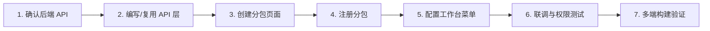

# EasyAIoT APP 二次开发详细设计文档

> 版本：基于 unibest 4.1.0 + EasyAIoT yudao-ui-admin-uniapp 2026.05.0-snapshot  
> 适用对象：需要在 EasyAIoT 移动端管理后台基础上扩展业务功能的开发者

---

## 1. 文档目的

本文档说明 EasyAIoT APP 的工程架构、核心机制与标准开发流程，帮助二次开发者：

- 快速搭建本地开发环境并对接 EasyAIoT 后端
- 按既有规范新增业务模块、页面、接口与菜单
- 理解权限、路由、请求、分包等横切能力
- 在多端（H5 / 微信小程序 / App）下正确发布与调试

---

## 2. 系统概述

### 2.1 定位

APP 是 EasyAIoT 平台的**移动端管理后台**，与 PC 端（WEB）共用同一套后端 API（`/admin-api`），面向运维、管理人员在移动场景下完成：

- 系统管理（用户、角色、租户等）
- 物联网设备管理（产品、设备、告警、OTA 等）
- 工作流审批、消息通知
- 以及 CRM / ERP / MES / WMS / 商城等可选模块

### 2.2 技术栈

| 层级 | 技术选型 | 说明 |
|------|----------|------|
| 跨端框架 | uni-app 3.x | 一套代码编译 H5、小程序、App |
| 前端框架 | Vue 3 + TypeScript | Composition API + `<script setup>` |
| 构建工具 | Vite 5 | 命令行开发，无需 HBuilderX（App 打包除外） |
| 包管理 | pnpm ≥ 9 | 强制使用 pnpm |
| 状态管理 | Pinia + persistedstate | 支持本地持久化 |
| UI 组件 | @wot-ui/ui 2.x | 主 UI 库，自动按需引入 |
| 业务组件 | yudao-ui（Yd 前缀） | EasyAIoT封装的上传、树选择、搜索等 |
| 样式 | UnoCSS | 原子化 CSS，优先使用 utility class |
| 分页 | z-paging | 列表页标准分页组件 |
| 路由 | vite-plugin-uni-pages | 约定式路由，自动生成 pages.json |

### 2.3 与后端的关系

```
┌─────────────┐     HTTP/HTTPS      ┌──────────────────┐
│  APP (H5/   │ ──────────────────► │  iot-gateway     │
│  小程序/App) │   /admin-api/*      │  :48080          │
└─────────────┘                     └────────┬─────────┘
                                             │
                              ┌──────────────┼──────────────┐
                              ▼              ▼              ▼
                        iot-system    iot-infra    iot-device ...
```

- 默认 API 前缀：`http://localhost:48080/admin-api`
- H5 开发环境可通过 Vite 代理转发，避免跨域
- 认证方式：OAuth2 Bearer Token（双 Token 模式：accessToken + refreshToken）
- 多租户：请求头自动携带 `tenant-id`（`VITE_APP_TENANT_ENABLE=true` 时）

---

## 3. 工程结构

```
APP/
├── env/                          # 环境变量（.env / .env.development / .env.production / .env.test）
├── docs/                         # 项目文档（含 unibest 官方文档与本设计文档）
├── scripts/                      # 构建辅助脚本
├── vite-plugins/                 # 自定义 Vite 插件
├── pages.config.ts               # 全局 pages 配置（easycom、tabBar、globalStyle）
├── manifest.config.ts            # 应用清单（AppID、权限、H5 base 等）
├── vite.config.ts                # Vite 构建核心配置（分包、组件解析、代理）
├── package.json
└── src/
    ├── api/                      # 按业务模块划分的 API 层（与后端 Controller 对应）
    ├── components/               # 全局组件
    │   └── yudao-ui/             # EasyAIoT业务组件（YdUpload、YdTreeSelect 等）
    ├── hooks/                    # 组合式函数（useAccess、useDict 等）
    ├── http/                     # HTTP 封装、拦截器、类型定义
    ├── layouts/                  # 页面布局
    ├── pages/                    # 主包页面（TabBar 页、首页工作台等）
    ├── pages-core/               # 分包：登录、注册、404 等核心页
    ├── pages-system/             # 分包：系统管理
    ├── pages-infra/              # 分包：基础设施
    ├── pages-iot/                # 分包：物联网（待/已扩展）
    ├── pages-bpm/                # 分包：工作流
    ├── ...pages-{module}/        # 其他业务分包
    ├── router/                   # 路由拦截（登录鉴权）
    ├── store/                    # Pinia 状态（token、user、dict、theme）
    ├── tabbar/                   # 底部导航配置与组件
    ├── utils/                    # 工具函数、字典枚举、加密等
    ├── static/                   # 静态资源
    ├── App.vue                   # 应用入口
    └── main.ts                   # 初始化：store、路由拦截、请求拦截
```

### 3.1 分包策略

主包 `src/pages/` 仅放 TabBar 相关页面，业务模块一律放入 `pages-{module}/` 分包，在 `vite.config.ts` 的 `UniPages.subPackages` 中注册：

```typescript
subPackages: [
  'src/pages-core',
  'src/pages-system',
  'src/pages-infra',
  'src/pages-iot',      // 物联网
  'src/pages-bpm',
  // ...
]
```

**规则：**

- 分包目录**不能**放在 `src/pages/` 下
- 新增分包必须在 `vite.config.ts` 注册，否则不会生成路由
- 组件目录 `components/`、`sections/` 会被排除在路由扫描之外

---

## 4. 环境配置

### 4.1 关键环境变量

配置文件位于 `env/.env`，按 mode 叠加 `env/.env.development` 等：

| 变量 | 说明 | 示例 |
|------|------|------|
| `VITE_APP_TITLE` | 应用标题 | `EasyAIoT 管理系统` |
| `VITE_APP_PORT` | H5 开发端口 | `9010` |
| `VITE_SERVER_BASEURL` | 后端 API 地址 | `http://localhost:48080/admin-api` |
| `VITE_APP_PROXY_ENABLE` | H5 是否走代理 | `true` |
| `VITE_APP_PROXY_PREFIX` | 代理前缀 | `/admin-api` |
| `VITE_AUTH_MODE` | 认证模式 | `double`（双 Token） |
| `VITE_APP_TENANT_ENABLE` | 多租户开关 | `true` |
| `VITE_APP_CAPTCHA_ENABLE` | 验证码开关 | `false` |
| `VITE_WX_APPID` | 微信小程序 AppID | 需替换为自己的 |
| `VITE_UPLOAD_TYPE` | 上传方式 | `server` / `client` |

### 4.2 本地开发前置条件

1. **Node.js** ≥ 20，**pnpm** ≥ 9
2. EasyAIoT 后端已启动（网关默认 `48080`）
3. 安装依赖并启动：

```bash
cd APP
pnpm install
pnpm dev          # H5，浏览器访问 http://localhost:9010
pnpm dev:mp-weixin # 微信小程序
pnpm dev:app       # App（需 HBuilderX 配合真机/模拟器）
```

4. 默认账号（可在 `.env` 修改）：
   - 租户 ID：`1`
   - 用户名：`admin`
   - 密码：`admin123`

### 4.3 对接自有后端

修改 `env/.env` 或对应 mode 文件中的 `VITE_SERVER_BASEURL`：

```bash
# 生产环境示例
VITE_SERVER_BASEURL = 'https://your-domain.com/admin-api'
VITE_APP_PROXY_ENABLE = false   # 生产 H5 不走代理
```

微信小程序需额外配置（按 envVersion 区分）：

```bash
VITE_SERVER_BASEURL__WEIXIN_DEVELOP = 'https://dev.xxx.com/admin-api'
VITE_SERVER_BASEURL__WEIXIN_TRIAL = 'https://trial.xxx.com/admin-api'
VITE_SERVER_BASEURL__WEIXIN_RELEASE = 'https://prod.xxx.com/admin-api'
```

---

## 5. 核心机制

### 5.1 约定式路由

页面文件即路由，通过 `definePage` 宏配置页面属性，构建时自动生成 `pages.json`：

```vue
<script lang="ts" setup>
definePage({
  style: {
    navigationBarTitleText: '用户管理',
    navigationStyle: 'custom',  // 使用 wd-navbar 自定义导航栏
  },
  excludeLoginPath: false,        // 是否加入登录白名单（可选）
})
</script>
```

**路径映射规则：**

| 文件路径 | 路由 path |
|----------|-----------|
| `src/pages/index/index.vue` | `/pages/index/index` |
| `src/pages-system/user/index.vue` | `/pages-system/user/index` |
| `src/pages-iot/device/device/index.vue` | `/pages-iot/device/device/index` |

跳转时使用完整 path（带 `/` 前缀）：

```typescript
uni.navigateTo({ url: '/pages-system/user/form/index?id=1' })
```

### 5.2 登录与路由拦截

登录策略在 `src/router/config.ts` 配置，当前为**白名单模式**（默认需登录）：

```typescript
export const LOGIN_STRATEGY = LOGIN_STRATEGY_MAP.DEFAULT_NEED_LOGIN
export const LOGIN_PAGE = '/pages-core/auth/login'
export const EXCLUDE_LOGIN_PATH_LIST = [ /* 无需登录的路径 */ ]
```

拦截器 `src/router/interceptor.ts` 在 `navigateTo` / `switchTab` 等跳转前检查 Token，未登录则重定向到登录页并携带 `redirect` 参数。

### 5.3 HTTP 请求链路

```
页面/Store
    ↓ 调用 api/*.ts
    ↓ http.get/post/put/delete (src/http/http.ts)
    ↓ uni.request 拦截器 (src/http/interceptor.ts)
        - 拼接 baseUrl / 代理前缀
        - 注入 Authorization: Bearer {token}
        - 注入 tenant-id
        - 可选 API 加密
    ↓ 后端 /admin-api/*
    ↓ 响应处理（401 自动 refreshToken、业务码校验、解密）
```

API 层示例（`src/api/system/user/index.ts`）：

```typescript
import type { PageParam, PageResult } from '@/http/types'
import { http } from '@/http/http'

export interface User { /* ... */ }

export function getUserPage(params: PageParam) {
  return http.get<PageResult<User>>('/system/user/page', params)
}

export function createUser(data: User) {
  return http.post<number>('/system/user/create', data)
}
```

### 5.4 权限控制

权限数据在登录后由 `getAuthPermissionInfo` 接口加载，存入 `useUserStore`：

- `permissions`：权限码数组，如 `system:user:list`
- `roles`：角色标识数组

页面内通过 `useAccess` Hook 判断：

```typescript
import { useAccess } from '@/hooks/useAccess'

const { hasAccessByCodes } = useAccess()

// 按钮级权限
<wd-fab v-if="hasAccessByCodes(['system:user:create'])" @click="handleAdd" />

// 菜单级权限（工作台 index.ts 中配置 permission 字段自动过滤）
```

### 5.5 字典与枚举

- 字典：登录后异步加载，`useDictStore` + `DICT_TYPE` 常量 + `<dict-tag>` 组件
- 业务枚举：`src/utils/constants/biz-*.ts`，如 `CommonStatusEnum`

```vue
<dict-tag :type="DICT_TYPE.COMMON_STATUS" :value="item.status" />
```

### 5.6 TabBar

配置在 `src/tabbar/config.ts`，当前使用**自定义 TabBar + 缓存**策略：

| Tab | 页面 | 说明 |
|-----|------|------|
| 工作台 | `/pages/index/index` | 菜单入口 |
| 审批 | `/pages/bpm/index` | 工作流 |
| 通讯录 | `/pages/contact/index` | 组织架构 |
| 消息 | `/pages/message/index` | 站内信 |
| 我的 | `/pages/user/index` | 个人中心 |

修改 TabBar 后需**重启 dev 命令**，以重新生成 `pages.json`。

---

## 6. 标准二次开发流程

以新增「IoT 设备管理」完整 CRUD 为例（API 已存在：`src/api/iot/device/device/index.ts`）。

### 6.1 总体步骤



### 6.2 Step 1：确认后端 API

对照 DEVICE 后端 Controller 或 Swagger，确认接口路径、请求/响应结构。  
IoT 设备接口前缀示例：`/iot/device/*`

### 6.3 Step 2：API 层

在 `src/api/iot/device/device/index.ts` 补充或新增方法（若已存在则跳过）：

```typescript
export function getDevicePage(params: PageParam) {
  return http.get<PageResult<Device>>('/iot/device/page', params)
}

export function getDevice(id: number) {
  return http.get<Device>(`/iot/device/get?id=${id}`)
}

export function createDevice(data: Device) {
  return http.post<number>('/iot/device/create', data)
}

export function updateDevice(data: Device) {
  return http.put<boolean>('/iot/device/update', data)
}

export function deleteDevice(id: number) {
  return http.delete<boolean>(`/iot/device/delete?id=${id}`)
}
```

命名约定：

- 分页：`getXxxPage`
- 详情：`getXxx`
- 创建/更新/删除：`createXxx` / `updateXxx` / `deleteXxx`
- 类型定义与后端 VO 保持一致，使用 `interface` 声明

### 6.4 Step 3：创建页面目录

推荐标准 CRUD 四页结构（参考 `pages-system/user/`）：

```
src/pages-iot/device/device/
├── index.vue                 # 列表页
├── form/index.vue            # 新增/编辑表单
├── detail/index.vue          # 详情页
└── components/
    └── search-form.vue       # 搜索条件组件
```

#### 6.4.1 列表页模板

```vue
<template>
  <view class="yd-page-container yd-page-container-paging">
    <wd-navbar title="设备管理" left-arrow placeholder safe-area-inset-top fixed @click-left="handleBack" />
    <SearchForm @search="handleQuery" @reset="handleReset" />
    <z-paging
      ref="pagingRef"
      v-model="list"
      :fixed="false"
      class="min-h-0 flex-1"
      :default-page-size="10"
      empty-view-text="暂无设备数据"
      @query="queryList"
    >
      <view class="p-24rpx">
        <view v-for="item in list" :key="item.id" class="mb-24rpx rounded-12rpx bg-white p-24rpx" @click="handleDetail(item)">
          <!-- 列表项内容 -->
        </view>
      </view>
    </z-paging>
    <wd-fab
      v-if="hasAccessByCodes(['iot:device:create'])"
      position="right-bottom"
      type="primary"
      :expandable="false"
      @click="handleAdd"
    />
  </view>
</template>

<script lang="ts" setup>
import type { Device } from '@/api/iot/device/device'
import { onUnload } from '@dcloudio/uni-app'
import { onMounted, ref } from 'vue'
import { getDevicePage } from '@/api/iot/device/device'
import { useAccess } from '@/hooks/useAccess'
import { navigateBackPlus } from '@/utils'
import SearchForm from './components/search-form.vue'

definePage({
  style: { navigationBarTitleText: '', navigationStyle: 'custom' },
})

const { hasAccessByCodes } = useAccess()
const list = ref<Device[]>([])
const queryParams = ref<Record<string, any>>({})
const pagingRef = ref<any>()

function handleBack() { navigateBackPlus() }

async function queryList(pageNo: number, pageSize: number) {
  try {
    const data = await getDevicePage({ ...queryParams.value, pageNo, pageSize })
    pagingRef.value?.completeByTotal(data.list, data.total)
  } catch {
    pagingRef.value?.complete(false)
  }
}

function handleQuery(data?: Record<string, any>) {
  queryParams.value = { ...data }
  pagingRef.value?.reload()
}

function handleReset() { handleQuery() }
function handleAdd() { uni.navigateTo({ url: '/pages-iot/device/device/form/index' }) }
function handleDetail(item: Device) {
  uni.navigateTo({ url: `/pages-iot/device/device/detail/index?id=${item.id}` })
}

onMounted(() => { uni.$on('iot:device:reload', () => pagingRef.value?.reload()) })
onUnload(() => { uni.$off('iot:device:reload') })
</script>
```

#### 6.4.2 表单页要点

- 通过 URL 参数 `id` 区分新增/编辑
- 使用 `wd-form` + `wd-form-item` + 校验 schema
- 字典字段用 `getIntDictOptions(DICT_TYPE.xxx)`
- 关联选择用 `YdSearchPicker` / `YdTreeSelect`
- 提交成功后 `uni.$emit('iot:device:reload')` 并返回列表

#### 6.4.3 详情页要点

- 只读展示 + 操作按钮（编辑、删除）
- 删除前 `wd-message-box` 确认
- 权限码：`iot:device:update`、`iot:device:delete`

### 6.5 Step 4：注册分包

若 `pages-iot` 尚未在 `vite.config.ts` 注册，添加：

```typescript
subPackages: [
  // ...
  'src/pages-iot',
]
```

修改后重启 `pnpm dev`。

### 6.6 Step 5：配置工作台菜单

编辑 `src/pages/index/index.ts`，在对应分组添加菜单项：

```typescript
{
  key: 'iotDevice',
  name: '设备管理',
  icon: 'wifi',
  url: '/pages-iot/device/device/index',
  iconColor: '#52c41a',
  permission: 'iot:device:query',  // 与后端权限码一致
}
```

菜单会自动按权限过滤，无权限的用户看不到入口。

### 6.7 Step 6：联调验证

检查清单：

- [ ] 列表分页、搜索、下拉刷新正常
- [ ] 新增/编辑/删除接口成功，列表自动刷新
- [ ] 无权限账号看不到 FAB 按钮和相关菜单
- [ ] Token 过期后自动 refresh 或跳转登录
- [ ] 多租户场景下数据隔离正确

---

## 7. 新增业务模块（完整模块）

若需新增独立业务域（如 `pages-custom/`），按以下清单操作：

| 序号 | 任务 | 文件/位置 |
|------|------|-----------|
| 1 | 创建分包目录 | `src/pages-custom/` |
| 2 | 注册分包 | `vite.config.ts` → `subPackages` |
| 3 | 创建 API 目录 | `src/api/custom/` |
| 4 | 添加枚举（如需要） | `src/utils/constants/biz-custom-enum.ts` |
| 5 | 配置菜单分组 | `src/pages/index/index.ts` |
| 6 | 配置 GROUP_ORDER | 同上文件，控制分组展示顺序 |
| 7 | 后端菜单权限 | DEVICE 后台配置对应菜单与权限码 |

---

## 8. UI 与组件规范

### 8.1 组件自动引入

| 前缀 | 来源 | 示例 |
|------|------|------|
| `Wd` | @wot-ui/ui | `<wd-button>`、`<wd-navbar>` |
| `Yd` | src/components/yudao-ui | `<YdUpload>`、`<YdTreeSelect>` |
| `ZPaging` | z-paging | `<z-paging>` |

无需手动 import，Vite 插件自动解析。

### 8.2 页面布局 CSS 类

| 类名 | 用途 |
|------|------|
| `yd-page-container` | 标准页面容器 |
| `yd-page-container-paging` | 带 z-paging 的列表页容器 |

### 8.3 样式约定

- **优先**使用 UnoCSS 原子类：`flex`、`p-24rpx`、`text-32rpx`、`rounded-12rpx`
- 尺寸单位使用 `rpx` 适配多端
- 自定义样式放 `<style lang="scss" scoped>`，尽量少写

### 8.4 可用EasyAIoT业务组件

| 组件 | 用途 |
|------|------|
| `YdUpload` / `YdUploadImg` / `YdUploadFile` | 文件/图片上传 |
| `YdSearchPicker` | 远程搜索选择器 |
| `YdFormPicker` | 表单选择器 |
| `YdTreeSelect` | 树形选择（部门等） |
| `YdSearchDateRange` | 日期范围搜索 |

---

## 9. 状态管理

| Store | 文件 | 职责 |
|-------|------|------|
| `useTokenStore` | `store/token.ts` | Token 存取、登录/登出、refresh |
| `useUserStore` | `store/user.ts` | 用户信息、角色、权限、租户 ID |
| `useDictStore` | `store/dict.ts` | 字典缓存 |
| `useThemeStore` | `store/theme.ts` | 主题配置 |

新增全局状态：

```typescript
// src/store/xxx.ts
import { defineStore } from 'pinia'

export const useXxxStore = defineStore('xxx', () => {
  // ...
}, { persist: true })  // 可选持久化
```

在 `src/store/index.ts` 中导出。

---

## 10. 多端适配

### 10.1 条件编译

```vue
<script setup lang="ts">
// #ifdef H5
// H5 特有逻辑
// #endif

// #ifdef MP-WEIXIN
// 微信小程序特有逻辑
// #endif

// #ifdef APP-PLUS
// App 特有逻辑
// #endif
</script>
```

### 10.2 平台差异注意点

| 场景 | H5 | 微信小程序 | App |
|------|-----|-----------|-----|
| API 地址 | 可走 Vite 代理 | 需配置合法域名 | 直连 baseUrl |
| 自定义 TabBar | 组件渲染 | 需 `custom: true` | 组件渲染 |
| 登录页 | 自定义 | 当前启用自定义登录 | 自定义 |
| 文件上传 | 标准 | 需配置 upload 合法域名 | 标准 |

### 10.3 构建命令

```bash
pnpm build:h5          # H5 生产包 → dist/build/h5
pnpm build:mp-weixin   # 微信小程序 → dist/build/mp-weixin
pnpm build:app         # App 资源包（需 HBuilderX 云打包/本地打包）
pnpm type-check        # TypeScript 类型检查
pnpm lint              # ESLint 检查
pnpm lint:fix          # 自动修复
```

---

## 11. 与 PC 端（WEB）协作

| 维度 | PC WEB | APP |
|------|--------|-----|
| API | 相同 `/admin-api` | 相同 |
| 权限码 | 相同 | 相同，通过 `permission` 字段控制 |
| 页面实现 | Element Plus | wot-ui + 移动端布局 |
| 复杂配置页 | 完整支持 | 部分功能标记 `ONLY_PC_PAGE`，跳转提示页 |

**建议：** 二次开发时先对照 PC 端同模块实现，复用 API 路径与 VO 结构，UI 按移动端交互重新设计。

---

## 12. 代码规范

### 12.1 文件命名

- 页面/组件：小写 + 连字符，如 `search-form.vue`
- API：按模块目录，`index.ts` 导出入口
- 类型：与后端 VO 同名或加 `ReqVO` / `RespVO` 后缀

### 12.2 Vue SFC 顺序

```vue
<script setup lang="ts">...</script>
<template>...</template>
<style lang="scss" scoped>...</style>
```

### 12.3 Git 提交

项目配置了 commitlint + husky，提交信息遵循 Conventional Commits：

```
feat(iot): 新增设备管理列表页
fix(auth): 修复 token 刷新失败跳转
docs: 补充二次开发设计文档
```

### 12.4 代码片段

在 `.vue` 文件中输入 `v3` + Tab，可快速生成页面模板。

---

## 13. 常见问题

### Q1：新增页面后路由 404？

- 确认文件不在 `components/` 目录下
- 确认分包已在 `vite.config.ts` 注册
- 重启 `pnpm dev` 重新生成 `pages.json`

### Q2：H5 请求跨域？

- 开发环境设置 `VITE_APP_PROXY_ENABLE=true`
- 确认后端网关已启动

### Q3：自动导入 API 报类型错误？

- 执行 `pnpm dev`，会自动生成 `src/types/auto-import.d.ts`

### Q4：修改 tabbar 不生效？

- 修改 `src/tabbar/config.ts` 后必须重启 dev
- 微信小程序需重新编译

### Q5：pages.json / manifest.json 要不要提交 Git？

- 项目 `.gitignore` 已忽略，由 `pnpm init-baseFiles` 在 prepare 阶段自动生成
- 不要手动长期维护这两个文件

---

## 14. 上游框架合并策略

APP 基于 [unibest](https://unibest.tech) 模板，并叠加EasyAIoT业务代码。后续若需同步 unibest 上游更新，请参考 `docs/merge/README.md`：

- **不建议**整库 merge，按月份 cherry-pick 低风险改动
- 重点关注：`vite.config.ts`、`router/interceptor.ts`、`store/token.ts`、`tabbar/*` 的冲突
- 每次合并后执行：`pnpm type-check`、H5 登录/tabbar 验证、微信小程序 build

---

## 15. 附录

### 15.1 现有 API 模块一览

| 目录 | 业务域 |
|------|--------|
| `api/system/` | 系统管理 |
| `api/infra/` | 基础设施 |
| `api/iot/` | 物联网 |
| `api/bpm/` | 工作流 |
| `api/crm/` | 客户管理 |
| `api/erp/` | ERP |
| `api/mes/` | 生产制造 |
| `api/wms/` | 仓储 |
| `api/mall/` | 商城 |
| `api/pay/` | 支付 |
| `api/member/` | 会员 |
| `api/mp/` | 公众号 |
| `api/ai/` | 大模型 |

### 15.2 参考页面（复制模板）

| 场景 | 参考路径 |
|------|----------|
| 标准 CRUD 列表 | `src/pages-system/user/index.vue` |
| 表单页 | `src/pages-system/user/form/index.vue` |
| 详情页 | `src/pages-system/user/detail/index.vue` |
| 搜索组件 | `src/pages-system/user/components/search-form.vue` |
| 工作台菜单 | `src/pages/index/index.ts` |
| 登录页 | `src/pages-core/auth/login.vue` |

### 15.3 相关文档

- unibest 官方文档：`APP/docs/`（VitePress 站点源文件）
- 快速开始：`docs/base/2-start.md`
- 环境变量：`docs/base/12-env.md`
- 请求封装：`docs/base/8-request.md`
- 状态管理：`docs/base/9-state.md`
- 构建发布：`docs/base/11-build.md`

---

## 16. 修订记录

| 日期 | 版本 | 说明 |
|------|------|------|
| 2026-06-24 | 1.0 | 初版，覆盖架构、标准 CRUD 流程、IoT 扩展示例 |
